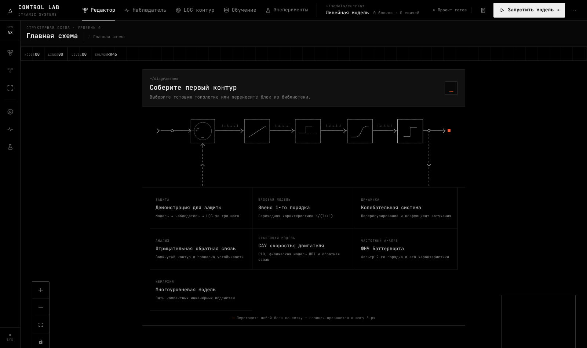
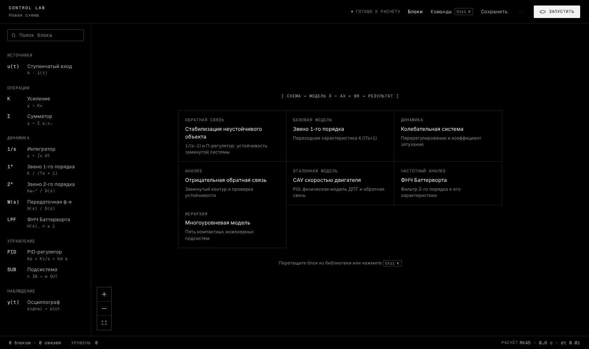
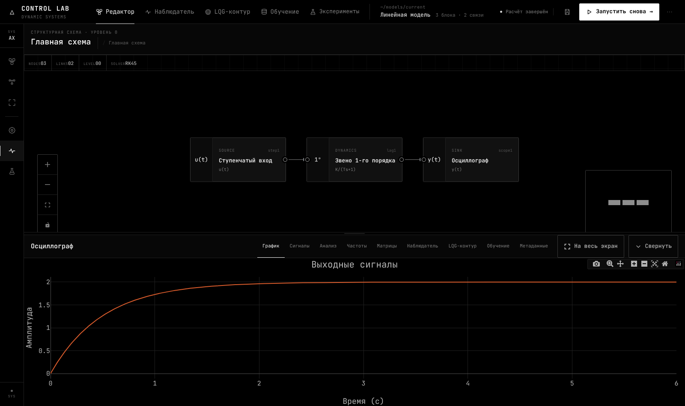
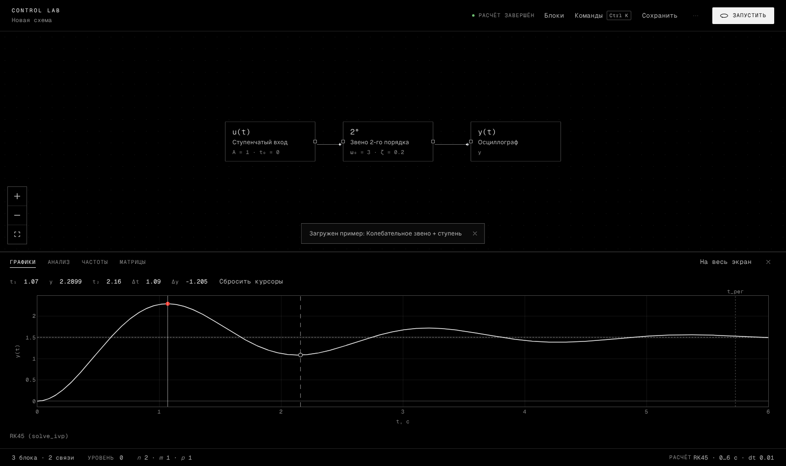
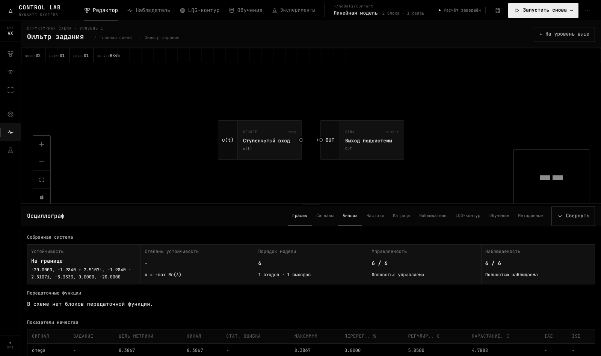
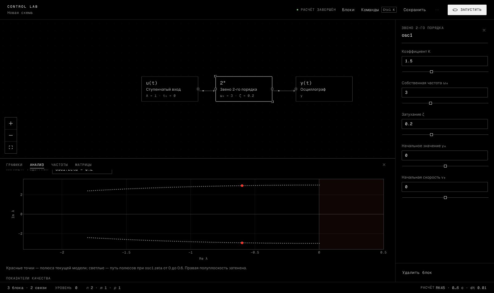
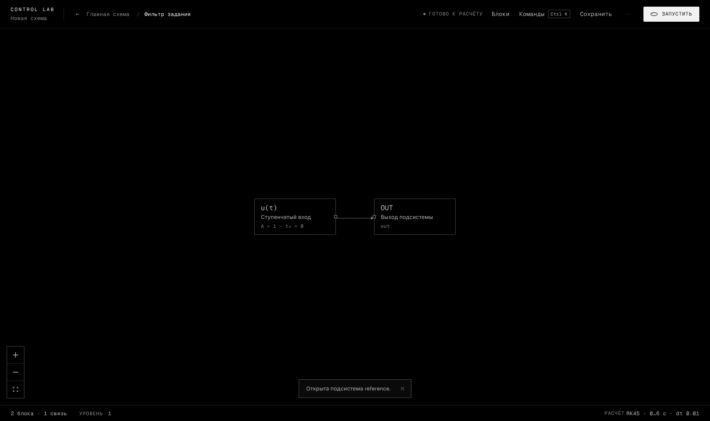
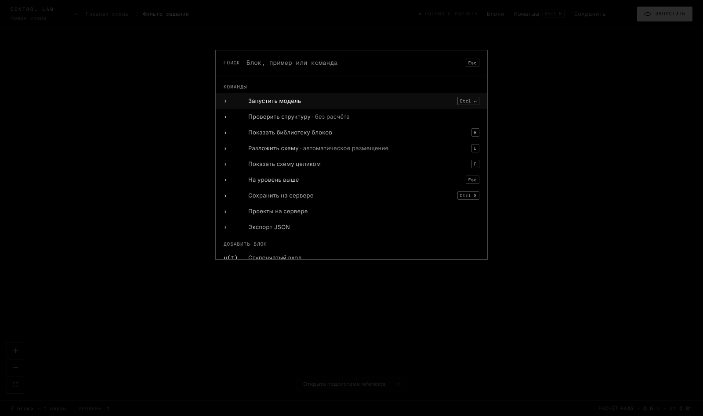

# UI/UX: редизайн «чёрный HUD»

Интерфейс переделан по видеореференсу пользователя. Это инструментальный HUD: чистый чёрный фон, белый и два
серых тона, линии толщиной 1 px, моноширинный шрифт, много пустого пространства и спокойные анимации. Неона,
градиентов, свечения и стекла нет. Цвет означает только состояние, а красная точка — текущее значение.

| До (архив) | После |
|---|---|
|  |  |
|  |  |
|  |  |

Дополнительно:  

## Что убрано или объединено

Каждый видимый элемент был проверен: если элемент дублировал другой, его убирали. Скрытые и
недостижимые элементы удалены.

| Было | Стало |
|---|---|
| Левая панель-rail: библиотека, раскладка, «показать целиком», параметры расчёта, результаты, точка состояния без стилей | Удалена. Библиотека — в шапке (`B`), раскладка и «показать целиком» — в Ctrl+K (`L`, `F`), решатель — в строке статуса, результаты — свернуть/развернуть док |
| Статус расчёта в четырёх местах с разными формулировками | Одна строка в шапке, печатается при смене состояния |
| Счётчики блоков и связей в шапке и в подвале инспектора, уровень в трёх местах, решатель в трёх местах | Одна строка статуса внизу: блоки, связи, уровень, `n m p`, решатель |
| Подпись холста «Структурная схема · уровень N» + заголовок | Удалена. Внутри подсистемы показываются хлебные крошки в шапке, выход — кнопка «←» или `Esc` |
| Два канала сообщений: уведомления над холстом и `info`, видимый только в инспекторе без выделения | Один тост внизу холста |
| Модальное окно параметров + вкладки инспектора «Блок / Расчёт» | Инспектор только для блока. Параметры редактируются на месте; у числовых параметров есть ползунок |
| «Готовые схемы» в библиотеке и стартовые карточки на холсте | Карточки на пустом холсте, полный список — в Ctrl+K |
| Вкладка диагностики «Результаты» (никогда не была видна), сводка «N ош. / N пред.» | Удалены |
| Заголовок «Результаты», состояние «Развернуть», «Осциллограф — полноэкранный режим» | Удалены или переименованы в «Графики» |
| Декоративная PNG-схема на пустом холсте | Удалена |
| «Очистить поле» без подтверждения | С подтверждением |

## Регистр

КАПСОМ с разрядкой пишутся только короткие ключи: кикеры разделов, ключи пар «ключ: значение», подписи строки
статуса, вкладки. Формулы и единицы (`y(∞)`, `t_рег`, `t, с`, `ζ`, `ω₀`), названия блоков, кнопки, пункты меню и
сообщения пишутся обычным регистром. Капс искажал символы: «ζ» превращалась в «Z», а `t, с` — в `T, C`.

## Новые возможности

* **Ctrl+K** — палитра команд: все действия, все блоки и все 17 примеров. Горячие клавиши: `Ctrl+Enter` —
  запуск, `Ctrl+S` — сохранение, `B` — библиотека, `L` — раскладка, `F` — показать схему целиком, `Esc` — уровень
  выше или закрыть, `Delete` / `Backspace` — удалить блок.
* **Живые параметры.** После первого расчёта любое изменение параметра пересчитывает модель в фоне: задержка
  150 мс, устаревшие запросы отменяются. Последний явный расчёт остаётся на графике пунктиром для сравнения.
* **Годограф.** Новый эндпоинт `POST /analyze/sweep` собирает модель заново для каждого значения параметра и
  возвращает полюса. На вкладке «Анализ» показаны полюса текущей модели (красные точки) и их путь при изменении
  выбранного параметра. Правая полуплоскость затенена.
* **Осциллограф.** Клик ставит курсор, Shift+клик — второй курсор. Показываются `t`, `y`, `Δt`, `Δy`, линия `y∞`,
  полоса ±2 % и отметка `t_рег` по показателям качества модели.
* **Поток сигнала.** После расчёта по связям бегут маленькие белые точки.

## Анимации

Текст печатается по буквам с «дешифровкой», линии-разделители вырастают от края, блоки и карточки появляются по
очереди. Кривая прорисовывается слева направо, числа растут от нуля, орбита на кнопке запуска во время расчёта
вращается быстрее. При входе в подсистему холст приближается, при выходе — отдаляется. Во время живого пересчёта
анимации входа отключены. Настоящий текст всегда остаётся в DOM для экранных дикторов и тестов. При
`prefers-reduced-motion` сразу показывается конечное состояние.

## Цвет и шрифт

* Токены — в `styles/tokens.css`: `#000`, текст `#f2f2f2` / `#b5b5b5` / `#8a8a8a` (контраст 6:1 и выше), линии
  `rgba(255,255,255,.14/.28)`. Акцент белый, красный (`#ff3b30`) используется только для точки.
* Шрифты: Geist Mono для интерфейса и чисел, Geist Sans для фраз.
* Один сигнал рисуется белым, два и больше — палитрой, проверенной на различимость при дальтонизме на `#000`
  (`plotTheme.ts`).

## CSS

Стили (`tokens.css`, `base.css`, `app.css`, `DiagnosticsPanel.module.css`) написаны заново, а не наложены поверх
старых.

## Проверка

`npm run check` (tsc, ESLint, unit-тесты) и 16 e2e-тестов Playwright на реальном backend. Новые e2e-тесты:
* параметр в инспекторе → полюс `1 − K`;
* Ctrl+K;
* живой пересчёт и годограф;
* курсоры осциллографа.

Скриншоты в `docs/ui/hud-*.png` сняты с работающего приложения.
