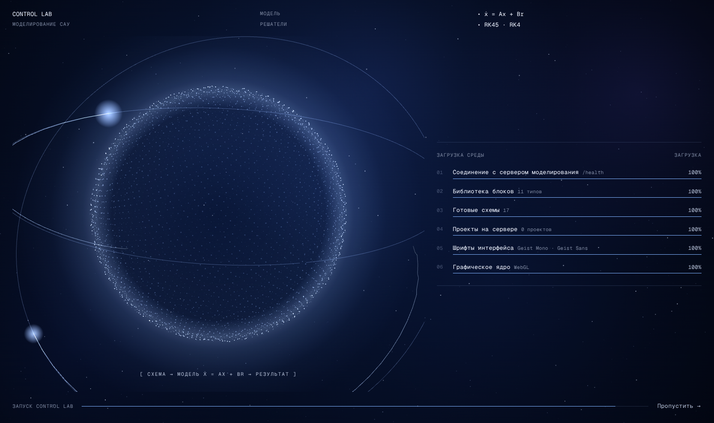
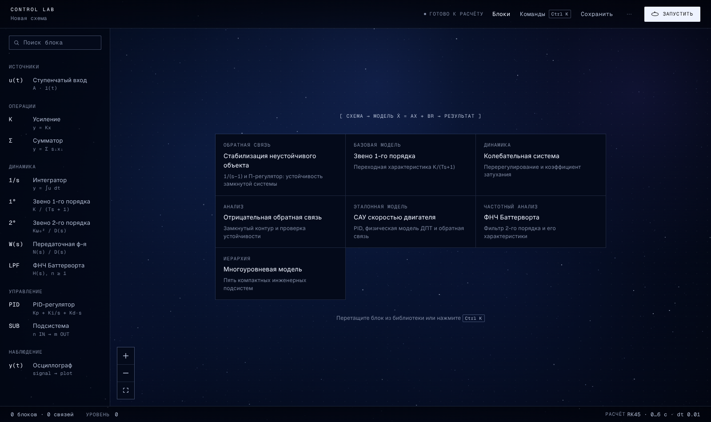
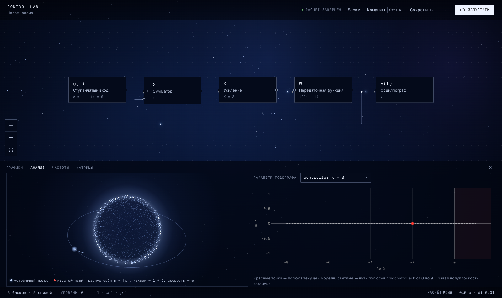

# UI/UX: редизайн «чёрный HUD»

Интерфейс переделан по видеореференсу пользователя. Это инструментальный HUD: чистый чёрный фон, белый и два
серых тона, линии толщиной 1 px, моноширинный шрифт, много пустого пространства и спокойные анимации. Неона,
градиентов, свечения и стекла нет. Цвет означает только состояние, а красная точка — текущее значение.
Правила, которым должны следовать дальнейшие изменения интерфейса, собраны в последнем разделе.

| До (архив) | После |
|---|---|
|  |  |
|  |  |
|  |  |

Дополнительно:  

## Итерация 3: «глубокий космос», заставка и сфера модели

По второму видеореференсу плоский чёрный фон заменён живым космическим, добавлены заставка и трёхмерная сфера
полюсов. Вся графика процедурная (Three.js, canvas), готовых изображений нет.

| Заставка | Редактор | Сфера модели |
|---|---|---|
|  |  |  |

* **Фон** (`components/space/SpaceBackdrop.tsx`) — тёмно-синий радиальный градиент, туманность, 520 мерцающих звёзд
  трёх слоёв глубины с параллаксом от мыши. По кнопке «Запустить» от источника сигнала по звёздам расходится волна.
  Панели интерфейса полупрозрачные, поэтому фон виден под схемой и графиками.
* **Заставка** (`components/intro/IntroSequence.tsx`) — 6000 частиц собираются в сферу, вокруг прочерчиваются
  орбиты с полюсами. Справа выполняются **настоящие** проверки запуска: `GET /health`, число типов блоков, число
  примеров, `GET /projects`, загрузка шрифтов, наличие WebGL. Полоса шага стоит на 90 %, пока проверка не ответит;
  при ошибке строка становится красной. Пропуск — любая клавиша или «Пропустить →». Отключается в меню «⋯ →
  Заставка при запуске» или параметром `?intro=0`.
* **Сфера модели** (`components/simulation/PoleSphere.tsx`, `features/sphere/ParticleSphere.ts`) — вкладка
  «Анализ», рядом с годографом. Каждый полюс λ = σ + jω — точка на своей орбите: радиус орбиты ∝ |λ|, наклон ∝ 1 − ζ,
  скорость обращения ∝ ω. Неустойчивый полюс (σ > 0) — красный, остальные — холодные белые.
* **Анимации не зависят от системы.** Если в Windows выключено «Показывать анимацию», браузер сообщает
  `prefers-reduced-motion`, и раньше все анимации пропадали (заставка длилась полсекунды). Теперь движение
  включено по умолчанию и выключается в меню «⋯ → Анимации» (класс `motion-off` на `<html>`, `localStorage`).
* **Красный** — только неустойчивость и ошибки: неустойчивый полюс, затенение правой полуплоскости, ошибка проверки.
  Текущие полюса на годографе и курсор осциллографа теперь голубые.

## Что убрано или объединено

Каждый видимый элемент был проверен: если элемент дублировал другой, его убирали. Скрытые и
недостижимые элементы удалены.

| Было | Стало |
|---|---|
| Левая панель-rail: библиотека, раскладка, «показать целиком», параметры расчёта, результаты, точка состояния без стилей | Удалена. Библиотека — в шапке (`B`), раскладка и «показать целиком» — в Ctrl+K (`L`, `F`), решатель — в строке статуса, результаты — свернуть/развернуть док |
| Статус расчёта в четырёх местах с разными формулировками | Одна строка в шапке, печатается при смене состояния |
| Счётчики блоков и связей в шапке и в подвале инспектора, уровень в трёх местах, решатель в трёх местах | Одна строка статуса внизу: блоки, связи, уровень, `n m p`, решатель |
| Подпись холста «Структурная схема · уровень N» + заголовок | Удалена. Внутри подсистемы показываются хлебные крошки в шапке, выход — кнопка «←» или `Esc` |
| Два канала сообщений: уведомления над холстом и `info`, видимый только в инспекторе без выделения | Один тост внизу холста |
| Модальное окно параметров + вкладки инспектора «Блок / Расчёт» | Инспектор только для блока. Параметры редактируются на месте; у числовых параметров есть ползунок |
| «Готовые схемы» в библиотеке и стартовые карточки на холсте | Карточки на пустом холсте, полный список — в Ctrl+K |
| Вкладка диагностики «Результаты» (никогда не была видна), сводка «N ош. / N пред.» | Удалены |
| Заголовок «Результаты», состояние «Развернуть», «Осциллограф — полноэкранный режим» | Удалены или переименованы в «Графики» |
| Декоративная PNG-схема на пустом холсте | Удалена |
| «Очистить поле» без подтверждения | С подтверждением |

## Регистр

КАПСОМ с разрядкой пишутся только короткие ключи: кикеры разделов, ключи пар «ключ: значение», подписи строки
статуса, вкладки. Формулы и единицы (`y(∞)`, `t_рег`, `t, с`, `ζ`, `ω₀`), названия блоков, кнопки, пункты меню и
сообщения пишутся обычным регистром. Капс искажал символы: «ζ» превращалась в «Z», а `t, с` — в `T, C`.

## Новые возможности

* **Ctrl+K** — палитра команд: все действия, все блоки и все 17 примеров. Горячие клавиши: `Ctrl+Enter` —
  запуск, `Ctrl+S` — сохранение, `B` — библиотека, `L` — раскладка, `F` — показать схему целиком, `Esc` — уровень
  выше или закрыть, `Delete` / `Backspace` — удалить блок.
* **Живые параметры.** После первого расчёта любое изменение параметра пересчитывает модель в фоне: задержка
  150 мс, устаревшие запросы отменяются. Последний явный расчёт остаётся на графике пунктиром для сравнения.
* **Годограф.** Новый эндпоинт `POST /analyze/sweep` собирает модель заново для каждого значения параметра и
  возвращает полюса. На вкладке «Анализ» показаны полюса текущей модели (красные точки) и их путь при изменении
  выбранного параметра. Правая полуплоскость затенена.
* **Осциллограф.** Клик ставит курсор, Shift+клик — второй курсор. Показываются `t`, `y`, `Δt`, `Δy`, линия `y∞`,
  полоса ±2 % и отметка `t_рег` по показателям качества модели.
* **Поток сигнала.** После расчёта по связям бегут маленькие белые точки.

## Анимации

Текст печатается по буквам с «дешифровкой», линии-разделители вырастают от края, блоки и карточки появляются по
очереди. Кривая прорисовывается слева направо, числа растут от нуля, орбита на кнопке запуска во время расчёта
вращается быстрее. При входе в подсистему холст приближается, при выходе — отдаляется. Во время живого пересчёта
анимации входа отключены. Настоящий текст всегда остаётся в DOM для экранных дикторов и тестов. При выключенной
настройке «Анимации» сразу показывается конечное состояние.

## Цвет и шрифт

* Токены — в `styles/tokens.css`: `#000`, текст `#f2f2f2` / `#b5b5b5` / `#8a8a8a` (контраст 6:1 и выше), линии
  `rgba(255,255,255,.14/.28)`. Акцент белый, красный (`#ff3b30`) используется только для точки.
* Шрифты: Geist Mono для интерфейса и чисел, Geist Sans для фраз.
* Один сигнал рисуется белым, два и больше — палитрой, проверенной на различимость при дальтонизме на `#000`
  (`plotTheme.ts`).

## CSS

Стили (`tokens.css`, `base.css`, `app.css`, `DiagnosticsPanel.module.css`) написаны заново, а не наложены поверх
старых.

## Проверка

`npm run check` (tsc, ESLint, unit-тесты) и 20 e2e-тестов Playwright на реальном backend. В тестах заставка
выключена через `storageState`; её проверяет `atmosphere.spec.ts` (в том числе при эмуляции
`reducedMotion: reduce`), там же — сфера модели и настройка анимаций. Тесты прошлой итерации:
* параметр в инспекторе → полюс `1 − K`;
* Ctrl+K;
* живой пересчёт и годограф;
* курсоры осциллографа.

Скриншоты в `docs/ui/hud-*.png` сняты с работающего приложения.

## Правила оформления

* **Цвета** берутся только из `frontend/src/styles/tokens.css`. Исключения: `components/plotTheme.ts`, который
  повторяет токены для Plotly, и свойства `MiniMap` / `Background` React Flow.
* **Сдержанность**: градиент и свечение есть только у космического фона, ореола сферы, кнопки запуска и
  выбранного блока (`--glow`). Панели полупрозрачные тёмно-синие, разделители — линии 1 px, радиус 2 px.
  Акцент белый, красный — только неустойчивость и ошибки.
* **Статусные цвета** означают только состояние и всегда идут вместе с подписью.
* **Данные**: один сигнал рисуется белым, несколько — палитрой `SERIES_COLORS` в фиксированном порядке.
* **Шрифты**: Geist Mono для интерфейса, чисел, формул и идентификаторов; Geist Sans для фраз.
* **Регистр**: капс (`.hud-key`, 11 px) только для коротких ключей. Минимальный кегль — 11 px.
* **Без дублей**: каждое значение, действие или статус показывается в одном месте. Счётчики и решатель — в
  строке статуса, сообщения — в тосте, параметры блока — в инспекторе. У любого действия есть пункт в Ctrl+K.
* **Результаты**: вкладки «Графики», «Анализ», «Частоты», «Матрицы». Вкладок для функций, не относящихся к
  структурным схемам, нет.
* **Обратная связь** рисуется как обычная линия. Есть ли петля и разрешима ли она, решает сервер.
* **Анимации** медленные и спокойные, никогда не блокируют ввод; выключаются настройкой «Анимации» в меню «⋯»,
  а не системным `prefers-reduced-motion`.
* **Проверка изменения**: `npm run check`, e2e-тесты на реальном backend и скриншоты основных экранов.
