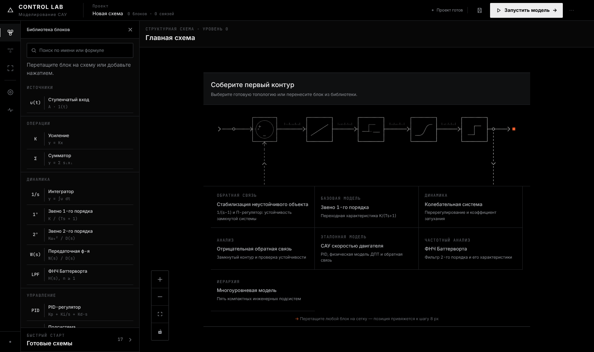
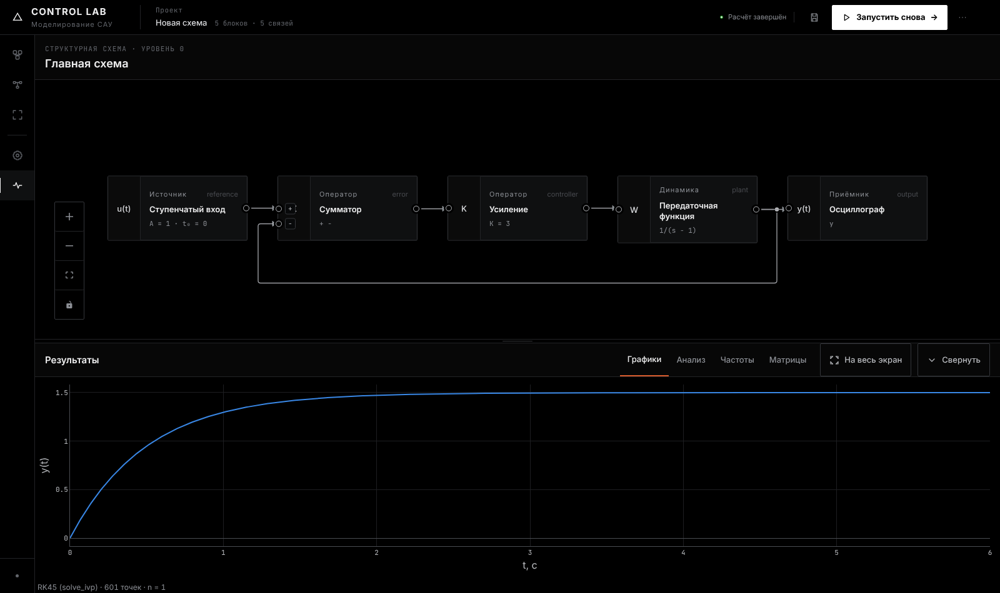
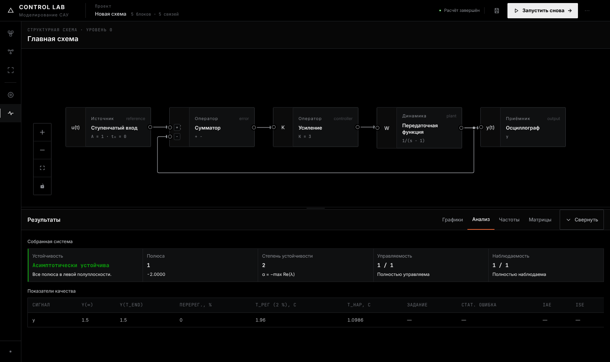
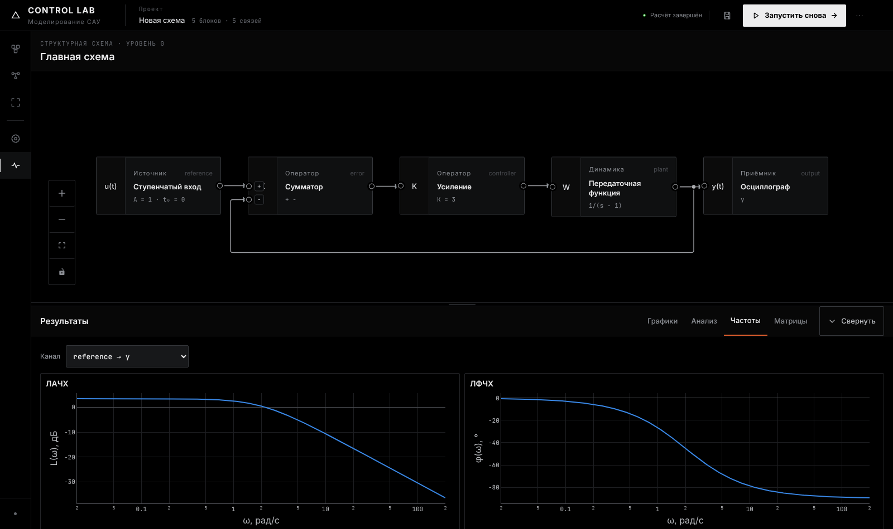
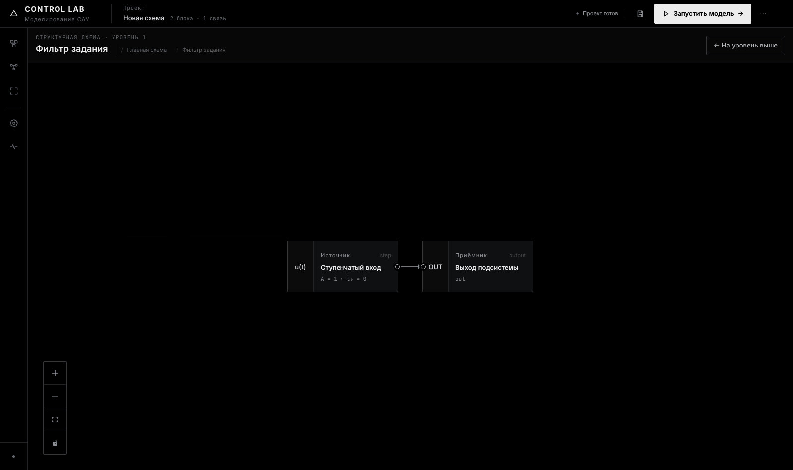

# UI/UX: аудит и изменения

Концепция интерфейса сохранена: тёмная инженерная среда с чёрным холстом, плоской геометрией и одним
акцентным цветом. Изменения касаются читаемости, различимости состояний, плотности и лишних элементов.

## Было и стало

| Было | Стало |
|---|---|
|  |  |
|  |  |
|  |  |

Дополнительно:  

## Найденные проблемы и решения

| Проблема | Решение |
|---|---|
| Весь интерфейс набран моноширинным шрифтом, 20 мест с подписями 8–10 px | Inter для интерфейса, JetBrains Mono только для чисел, формул и идентификаторов; минимум 11 px |
| `--success`, `--warning`, `--danger` почти одного серого цвета: статусы неразличимы | статусная палитра (хорошо / предупреждение / серьёзно / критично), всегда с подписью |
| Блоки с ошибками не выделялись: класс `has-diagnostic-*` выставлялся, но стилей не было | красная рамка и подложка для ошибки, жёлтая рамка для предупреждения |
| 5 режимов навигации и 9 вкладок результатов, большинство — стенды вне моделирования схем | один рабочий режим; вкладки «Графики», «Анализ», «Частоты», «Матрицы» |
| Активная вкладка и вкладка под курсором оформлены одинаково («две активные») | наведение меняет только цвет, активная вкладка подчёркнута акцентом |
| Блок показывал английскую категорию, id и повтор символа | русская категория, ключевой параметр (`K = 3`, `1/(s − 1)`) |
| Обратные связи пунктирные: смысл петли выводился из геометрии | все сигналы рисуются одинаково, петли определяет сервер |
| Полоса телеметрии NODES/LINKS/LEVEL/SOLVER, `~/models/current`, `SYS AX` | убраны: счётчики есть в шапке, уровень — в хлебных крошках |
| Двойной заголовок библиотеки, «Главная схема / Главная схема» на корневом уровне | лишнее убрано; хлебные крошки показываются только внутри подсистем |
| Мини-карта перекрывала блоки маленьких схем | показывается при числе блоков больше 8 |
| Декоративные PNG в инспекторе и на вкладке матриц | удалены; на стартовом экране осталась схема контура, она иллюстрирует сам продукт |
| Графики: заголовок, моноширинный шрифт, стандартная панель Plotly, оранжевая палитра без проверки | тема Plotly в `plotTheme.ts`, палитра проверена для дальтоников на чёрном фоне, курсор с подсказкой, компактная панель, легенда только при ≥ 2 сериях |
| Предупреждения сервера (`warnings`) нигде не показывались | выводятся под графиком |
| Ошибки сохранения и открытия проектов записывались в скрытый список | строка уведомлений над холстом |
| Основная кнопка сохранения сохраняла JSON | основное действие — сервер (Ctrl+S); импорт и экспорт JSON в меню |
| Библиотека блоков скрыта при запуске | открыта по умолчанию |
| Нельзя сравнить результат до и после изменения параметра | наложение предыдущего расчёта той же схемы (переключаемое) |

## CSS

| | Было | Стало |
|---|---|---|
| Файлы | tokens, base, workbench, experiments, axiom (слой поверх workbench) | tokens, base, app |
| Строк (вместе с CSS-модулем диагностики) | 7 172 | 4 805 |
| Объявлений, перекрытых более поздним слоем | 498 | 0 |

Чистка выполнена механически. Удалялись классы, которых нет в исходниках, и объявления, которые позже
переопределены тем же селектором в том же `@media`. Результат проверен попиксельно (pixelmatch) на восьми экранах:
расхождение 0,000 %. Оставшиеся `!important` относятся к `.visually-hidden`, `prefers-reduced-motion`, печати и
переопределению inline-стилей React Flow.

## Что не делалось намеренно

* Светлая тема.
* Изменение компоновки: шапка, rail, библиотека, холст, док результатов, инспектор.
* Новые режимы и панели ради демонстрации интерфейса.
