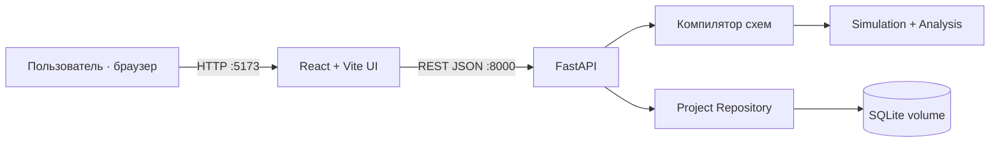
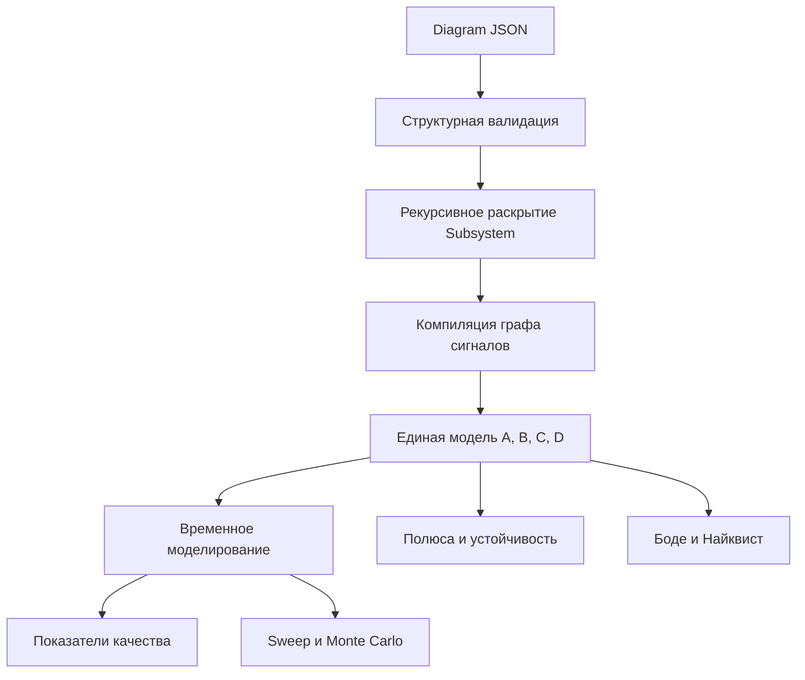
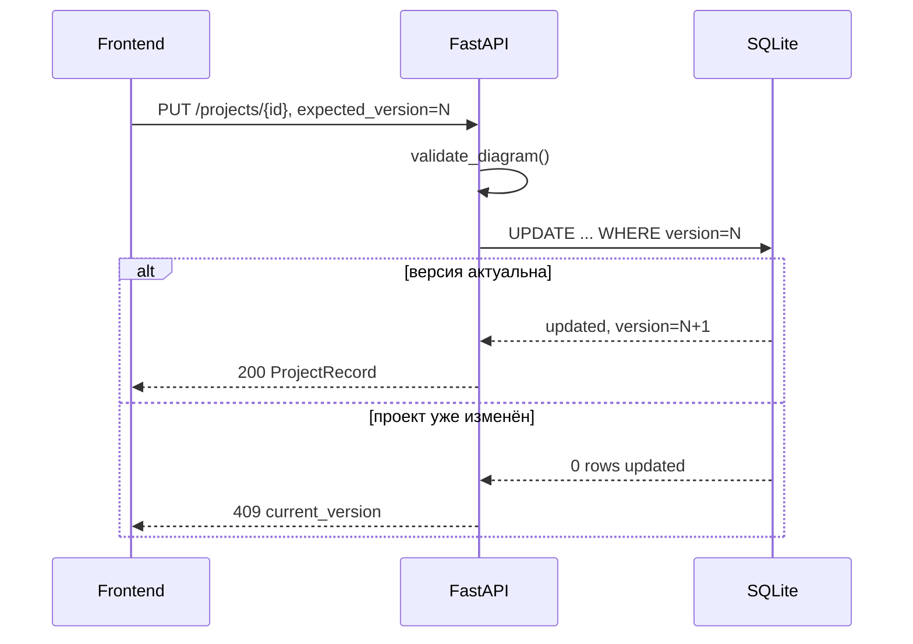

# Архитектура Control Lab

## Контейнеры и внешние интерфейсы



Frontend отвечает за редактирование структурной схемы, навигацию по
подсистемам, визуализацию и управление проектами. Backend является единственным
источником математической истины: повторно валидирует схему, разворачивает
иерархию, строит модель и выполняет расчёты.

## Расчётный pipeline



Внутренние идентификаторы подсистем получают полный путь, например
`plant::actuator::motor`. Поэтому состояния, ошибки и результаты анализа можно
однозначно связать с исходным уровнем схемы.

## Хранение проектов



Локальный JSON предназначен для переноса и резервной копии. SQLite хранит
серверные проекты между запусками контейнеров в именованном томе
`project-data`.

## Запуск контейнерной версии

```bash
docker compose up --build
```

После запуска:

- UI: `http://localhost:5173`;
- API и Swagger: `http://localhost:8000/docs`;
- healthcheck: `http://localhost:8000/health`.
