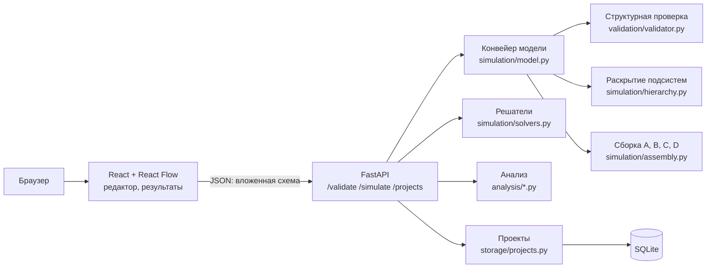
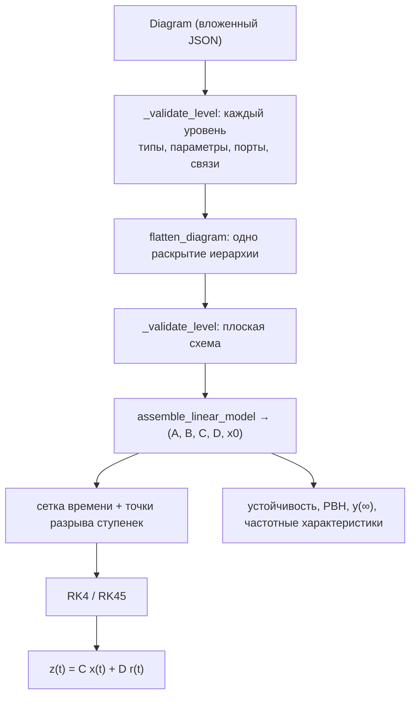

# Архитектура Control Lab

Control Lab — веб-среда визуального моделирования линейных непрерывных САУ. Пользователь собирает
многоуровневую структурную схему; сервер раскрывает подсистемы, собирает единую модель в пространстве
состояний, проверяет её корректность и рассчитывает переходные процессы.

```
блоки → соединения → обратные связи → подсистемы → модель (A, B, C, D) → расчёт → результаты
```

## 1. Компоненты



| Слой | Файлы | Ответственность |
|---|---|---|
| Редактор | `frontend/src/pages/MainPage.tsx`, `nodes/BlockNode.tsx`, `components/DiagramEdges.tsx` | блоки, связи, навигация по уровням, сохранение |
| Подсказки редактора | `features/modelDiagnostics.ts`, `features/blockParameters.ts` | мгновенная проверка портов и параметров до отправки на сервер |
| Результаты | `components/SimulationChart.tsx`, `components/simulation/StateSpacePanel.tsx` | графики, анализ, частоты, матрицы |
| API | `backend/app/api/routes.py`, `api/errors.py` | 9 эндпоинтов, единый формат ошибок `{code, message, errors}` |
| Модель | `simulation/model.py`, `validation/validator.py`, `simulation/hierarchy.py`, `simulation/assembly.py` | схема → проверенная плоская схема → `LinearModel` |
| Расчёт | `simulation/solvers.py`, `simulation/service.py` | RK4, RK45, точное решение, сетка времени, разрывы |
| Анализ | `analysis/stability.py`, `analysis/system.py`, `analysis/quality.py`, `analysis/frequency.py`, `analysis/sweep.py` | устойчивость, PBH, показатели качества, частотные характеристики, годограф |
| Хранение | `storage/projects.py` | SQLite, версия схемы БД, оптимистическая блокировка |

Сервер — единственный источник математической истины. Правила в редакторе (`blockParameters.ts`) зеркалят
`core/block_specs.py`, но служат только для того, чтобы указать на ошибочный блок до запроса.

## 2. Конвейер одного запроса `/simulate`



Схема проверяется и раскрывается **один раз** (`compile_model`). Если структура неверна или петля
неразрешима, выбрасывается `DiagramCompilationError`, и API отвечает 422 `diagram_invalid` с перечнем причин.

## 3. Раскрытие вложенных подсистем

Подсистема — блок `Subsystem` со вложенной схемой в `parameters.diagram`. Внутри неё блоки `SubsystemInput` и
`SubsystemOutput` с параметром `port` задают внешние порты. Их порядок определяет порты блока-обёртки.

`_expand_level(diagram, prefix)` рекурсивно обходит уровни и возвращает:

* `blocks`, `connections` — блоки и связи без обёрток, с идентификаторами `префикс::id`
  (например `plant::actuator::motor`). Префикс делает идентификаторы уникальными, даже если одна и та же подсистема
  вставлена несколько раз;
* `input_targets[port]` — список внутренних входов, куда идёт внешний порт;
* `output_sources[port]` — внутренний источник сигнала внешнего выхода.

Каждая связь уровня разрешается в плоскую связь «источник → приёмник»:

1. **Источник.** Обычный блок даёт `(префикс::id, порт)`. Подсистема даёт `output_sources` своего потомка.
   `SubsystemInput` даёт псевдоисточник `(@input, порт)`, который разрешает родительский уровень.
2. **Приёмник.** Обычный блок даёт сам себя. Подсистема даёт `input_targets` потомка. `SubsystemOutput` регистрирует
   источник выхода этого уровня.
3. **Прямой проход** `SubsystemInput → SubsystemOutput`: выход ссылается на псевдоисточник `@input`. Родитель
   подставляет вместо него то, что подключено к соответствующему входу подсистемы. Подстановка рекурсивная, поэтому
   проход сквозь несколько уровней работает, а замыкание порта самого на себя отвергается.

Метки `Scope` внутри подсистем получают путь (`stage_a/inner`), поэтому несколько экземпляров одной подсистемы
дают разные сигналы. Разделитель `::` и префикс `@` зарезервированы: идентификатор блока с ними отвергается
валидатором, иначе он мог бы совпасть с путём другого блока или с псевдоисточником `@input`. После раскрытия плоская схема проверяется ещё раз: связи через границы уровней становятся
обычными связями и подчиняются тем же правилам.

## 4. Сборка модели: компилятор структурной схемы

### 4.1 Звенья

Каждый блок плоской схемы `i` — линейная система `ẋᵢ = Aᵢxᵢ + Bᵢuᵢ, yᵢ = Cᵢxᵢ + Dᵢuᵢ`
(`assembly.block_realization`):

| Блок | Реализация |
|---|---|
| Gain | `D = [k]` |
| Sum | `D = [s₁ … s_m]`, sᵢ = ±1 |
| Integrator | `A = 0, B = k, C = 1, D = 0` |
| FirstOrderLag `k/(Ts+1)` | `A = −1/T, B = k/T, C = 1` |
| SecondOrderOscillator | `A = [[0, 1], [−ω₀², −2ζω₀]], B = [0, kω₀²]ᵀ, C = [1, 0]` |
| TransferFunction, PID, Butterworth | управляемая каноническая форма (`scipy.signal.tf2ss`); бипропер — `D ≠ 0` |

`StepInput` — внешний источник `r`, `Scope` — внешний выход `z`.

### 4.2 Матрица соединений

Блочно-диагональное объединение даёт `ẋ = A_d x + B_d u_b, y_b = C_d x + D_d u_b`. Здесь `u_b` — все входные
порты блоков, `y_b` — все выходы. Каждый вход читает ровно один сигнал (это проверяет валидатор):

```
u_b = M y_b + N r,          z = S_y y_b + S_r r
```

`M_jk = 1`, если вход `j` подключён к выходу `k`. Ветвление сигнала — несколько единиц в одном столбце `M`.

### 4.3 Алгебраические связи и обратная связь

Подстановка `u_b` даёт систему уравнений схемы:

```
(I − D_d M) y_b = C_d x + D_d N r
```

* Матрица `G = D_d M` описывает прямое прохождение сигнала. Ненулевой элемент `G_ik` означает, что выход `i`
  мгновенно зависит от выхода `k`.
* Выходы группируются в **сильно связные компоненты** графа `G` и обрабатываются в топологическом порядке.
  Компонента из одного выхода без петли вычисляется подстановкой. Длинная цепочка больших коэффициентов поэтому
  не превращается в плохо обусловленную систему.
* Компонента с циклом — **алгебраическая петля**. Её подсистема `(I − G_cc) Y_c = RHS_c` решается
  LU-разложением, обратная матрица явно не вычисляется. Перед решением оценивается чувствительность
  `κ = (1 + ‖G_cc‖₂) / σ_min(I − G_cc)`:
  * `σ_min ≈ 0` — петля неразрешима (например, `y = u + y`); ответ называет её блоки;
  * `κ > 1/√ε ≈ 6.7·10⁷` — петля плохо обусловлена, решение отвергается как недостоверное;
  * иначе петля корректна и решается. Это касается петли через бипропер-звено или PID с `Kd`, а также статической
    петли `k/(1+k)`.
* **Обратная связь через динамику** (интегратор, апериодическое звено) не создаёт алгебраической петли: выход
  такого звена зависит только от состояния. Петля замыкается через матрицу `A`.

Обратная связь — свойство уравнений, а не рисунка. Редактор прокладывает «обратные» линии в обход блоков,
но ни геометрия, ни поиск обратных дуг в DFS не определяют её смысла.

### 4.4 Итоговая модель

При решении `y_b = Y_x x + Y_r r`:

```
A = A_d + B_d M Y_x        B = B_d (M Y_r + N)
C = S_y Y_x                D = S_y Y_r + S_r
```

Размерности: `A n×n, B n×m, C p×n, D p×m`, где `m` — число StepInput, а `p` — число Scope. Порядок состояний
совпадает с порядком блоков. Таблица «состояние → блок → путь подсистемы» возвращается в
`metadata.provenance.state_mapping`.

### 4.5 Проверка компилятора

* `app/tests/structural_cases.py` — 16 эталонных схем с передаточными матрицами из правил структурных преобразований:
  последовательное и параллельное соединение, ветвление, ± ОС, PID-контур, бипропер- и статическая петли,
  подсистема, два экземпляра, прямой проход, три уровня, MIMO-подсистема, Баттерворт.
  Проверяется `C(sI − A)⁻¹B + D = G(s)` в четырёх точках `s`; результат не зависит от порядка состояний.
* `app/tests/reference_evaluator.py` — исходный поблочный компилятор, который считал `rhs` по топологическому порядку
  блоков. Он оставлен как независимая реализация: на 14 схемах, которые он поддерживает, матрицы, `rhs` и показания
  Scope совпадают с новой сборкой с точностью до `10⁻¹²`.

## 5. Численное интегрирование

| Метод | Где | Особенности |
|---|---|---|
| RK4, постоянный шаг | `rk4_integrate` | точки разрыва ступенек добавляются в сетку; последний этап шага, оканчивающегося на разрыве, берёт левый предел входа |
| RK45 (Дорман — Принс) | `solve_ivp_integrate` | `rtol = 1e-8, atol = 1e-10`; перезапуск на каждом разрыве |
| Точное решение | `exact_lti_integrate` | `x(t+h) = e^{Ah}x + ∫₀ʰe^{As}ds·Br` через экспоненту блочной матрицы; эталон для тестов и исследования |

Перед RK4 проверяется **численная** устойчивость шага (`analysis/stability.rk4_step_check`):
* для мод с `Re λ ≤ 0` (включая мнимую ось) требуется `|R(hλ)| ≤ 1`, где `R(z) = 1 + z + z²/2 + z³/6 + z⁴/24`.
  Если условие нарушено, расчёт отвергается с подсказкой `dt_max`;
* для физически растущих мод (`Re λ > 0`) рост настоящий, поэтому расчёт выполняется. Если множитель
  `R(hλ)` отличается от `e^{hλ}` более чем на 1 %, выдаётся предупреждение о точности.

## 6. Анализ собранной модели

* **Устойчивость** (`classify_stability`). Собственные значения сбалансированной `A` группируются в кластеры.
  Полюс в правой полуплоскости даёт «неустойчива». Кратный полюс на мнимой оси с жордановой клеткой
  (геометрическая кратность меньше алгебраической) тоже даёт «неустойчива», например `1/s²` или `(s²+1)²`.
  Простые полюса на оси дают «на границе», остальные случаи — «асимптотически устойчива».
  Допуски относительные и локальные. Кандидаты на мнимую ось отбираются с порогом `ε^(1/3)·‖A‖`. Затем
  упорядоченная форма Шура выделяет их инвариантное подпространство, и окончательное решение принимается с порогом
  `√ε` относительно нормы этого подпространства. Быстрый блок в другой части схемы поэтому не размывает медленные
  полюса. Порог `√ε` покрывает разброс `ε^(1/2)` вычисленного двукратного собственного значения.
* **Управляемость и наблюдаемость** — тест PBH `rank[λI − A, B] = n` на сбалансированной реализации
  `(T⁻¹AT, T⁻¹B, CT)`, с запасом `σ_min/σ_max`. Ранг матрицы Калмана ошибается уже для фильтра Баттерворта
  порядка 8 (см. `docs/numerical_study.md`).
* **Показатели качества.** Установившееся значение берётся из модели: `y∞ = (D − CA⁻¹B) r`, только для
  асимптотически устойчивой системы. Перерегулирование, время нарастания (10–90 %) и время регулирования
  (полоса ±2 % от `|y∞ − y(t_ступ)|`) отсчитываются от момента ступеньки. Если `y∞` не существует,
  показатели не выдаются, а пользователь видит причину. То же происходит, если ступенька включается после окончания
  интервала моделирования.
* **Годограф** (`analysis/sweep.py`, `POST /analyze/sweep`) — полюса `A` для каждого значения одного числового
  параметра блока (до 200 значений). Модель собирается заново на каждом значении, поэтому годограф точен
  для любого параметра: коэффициента петли, постоянной времени, затухания, коэффициентов PID. Если при
  каком-то значении алгебраическая петля вырождается, это значение возвращается с причиной, а не с полюсами.
* **Частотные характеристики** — ЛАЧХ, ЛФЧХ и АФЧХ для каждого канала «вход → выход». Запасы устойчивости
  не вычисляются: для замкнутого контура канал описывает замкнутую систему, а запасы требуют разомкнутой петли.

## 7. Хранение проектов

* **Сервер, основное хранилище.** `storage/projects.py`: SQLite в режиме WAL, одно соединение на операцию,
  соединение всегда закрывается. `PRAGMA user_version` хранит версию схемы БД; базы без версии из прошлых сборок
  мигрируются. Оптимистическая блокировка `version`: при параллельном изменении API отвечает 409, и редактор
  предлагает открыть актуальную версию или сохранить копию. Сохраняется только корректная схема.
* **JSON, импорт и экспорт.** `features/diagramPersistence.ts`, формат `nir-dynamics-project` v1, лимит 5 МБ.
  Подробности — в `docs/diagram_persistence.md`.

Положения блоков вложенных уровней хранятся в `Subsystem.parameters.layout`. Перед сохранением открытый уровень
записывается во все родительские уровни (`foldHierarchy`), поэтому сохранение изнутри подсистемы не теряет
расположение блоков.

## 8. Ограничения

* Только линейные стационарные непрерывные звенья. Нелинейные (насыщение) и дискретные блоки не поддерживаются;
  их добавление потребует поблочного вычисления правой части.
* Единственный источник — ступенчатый сигнал. Синус и линейно нарастающий сигнал — направление развития.
* Начальные условия есть у интегратора и звеньев 1-го и 2-го порядка. TF и PID стартуют из нуля; `y0` фильтра
  Баттерворта задаёт состояние минимальной нормы с `y(0) = y0`, а не равновесие.
* Разрешение по полюсам. Различные полюса на мнимой оси, отстоящие друг от друга меньше чем на `≈ ε^(1/3) ≈ 6·10⁻⁶`
  относительно `‖A‖`, считаются одним кратным полюсом. Если у такой пары нет общего собственного вектора, система
  будет ошибочно названа неустойчивой. Такой порог — цена надёжного распознавания жордановых клеток
  в арифметике с плавающей точкой: кратный полюс вычисляется с разбросом `ε^(1/k)`.
* Идентификаторы блоков не могут содержать `::` и начинаться с `@`.
