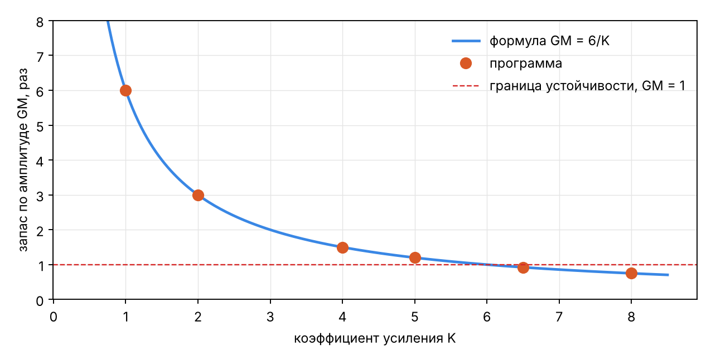
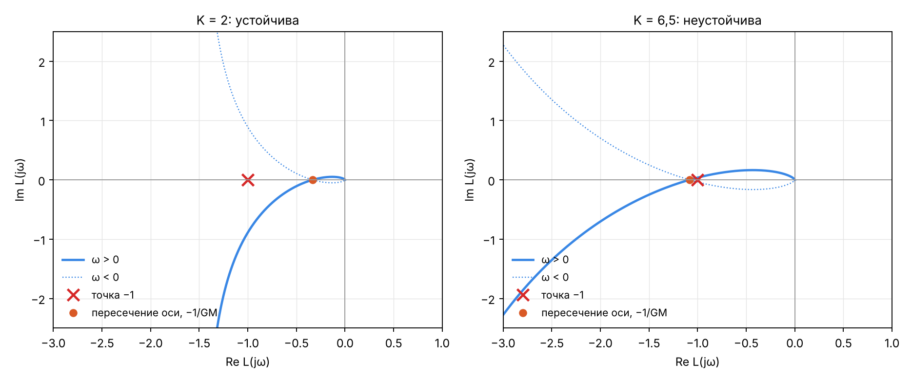
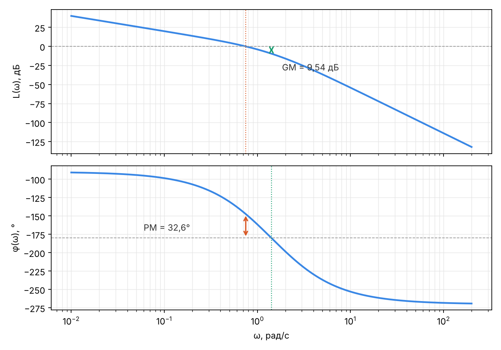

# Проверка модуля запасов устойчивости

_Сгенерировано `backend/scripts/kp_margins_study.py` · Python 3.13.16 · Linux-6.18.44-fc-v114-x86_64-with-glibc2.39._

## 1. Контур K/(s(s+1)(s+2))

| K | GM (программа) | GM = 6/K | ω_π (программа) | ω_π = √2 | PM (программа), ° | PM (формула), ° | Найквист | Гурвиц | теория (K < 6) |
|---|---|---|---|---|---|---|---|---|---|
| 0.5 | 12.000000 | 12.000000 | 1.414214 | 1.414214 | 69.556 | 69.556 | устойчива | устойчива | устойчива |
| 1.0 | 6.000000 | 6.000000 | 1.414214 | 1.414214 | 53.411 | 53.411 | устойчива | устойчива | устойчива |
| 2.0 | 3.000000 | 3.000000 | 1.414214 | 1.414214 | 32.613 | 32.613 | устойчива | устойчива | устойчива |
| 4.0 | 1.500000 | 1.500000 | 1.414214 | 1.414214 | 11.425 | 11.425 | устойчива | устойчива | устойчива |
| 5.0 | 1.200000 | 1.200000 | 1.414214 | 1.414214 | 5.023 | 5.023 | устойчива | устойчива | устойчива |
| 6.5 | 0.923077 | 0.923077 | 1.414214 | 1.414214 | -2.143 | -2.143 | неустойчива | неустойчива | неустойчива |
| 8.0 | 0.750000 | 0.750000 | 1.414214 | 1.414214 | -7.518 | -7.518 | неустойчива | неустойчива | неустойчива |

## 2. Контур K/(s(s+1))

| K | ω_с (программа) | ω_с (формула) | PM (программа), ° | PM = 90° − arctg ω_с | GM |
|---|---|---|---|---|---|
| 0.5 | 0.45509 | 0.45509 | 65.530 | 65.530 | ∞ |
| 1.0 | 0.78615 | 0.78615 | 51.827 | 51.827 | ∞ |
| 4.0 | 1.87913 | 1.87913 | 28.020 | 28.020 | ∞ |
| 10.0 | 3.08423 | 3.08423 | 17.964 | 17.964 | ∞ |

## 3. Неустойчивый объект K/(s−1)

| K | P | N | Z = N + P | неуст. полюсов замкнутой | Найквист | теория (K > 1) | GM (нижний) | 1/K |
|---|---|---|---|---|---|---|---|---|
| 0.5 | 1 | 0 | 1 | 1 | неустойчива | неустойчива | 2.0000 | 2.0000 |
| 0.9 | 1 | 0 | 1 | 1 | неустойчива | неустойчива | 1.1111 | 1.1111 |
| 1.5 | 1 | -1 | 0 | 0 | устойчива | устойчива | 0.6667 | 0.6667 |
| 3.0 | 1 | -1 | 0 | 0 | устойчива | устойчива | 0.3333 | 0.3333 |
| 10.0 | 1 | -1 | 0 | 0 | устойчива | устойчива | 0.1000 | 0.1000 |

## 4. Разрез в разных связях одного контура (K = 2)

| разрез | GM | PM, ° | ω_с | Найквист |
|---|---|---|---|---|
| e.out → k.in | 3.000000000 | 32.613097 | 0.749368 | устойчива |
| k.out → w.in | 3.000000000 | 32.613097 | 0.749368 | устойчива |
| w.out → e.in2 | 3.000000000 | 32.613097 | 0.749368 | устойчива |

## 5. Усиление контура в GM раз выводит полюс на мнимую ось

| контур | GM | max Re λ при K·GM | частота колебаний при K·GM | ω_π |
|---|---|---|---|---|
| K/(s(s+1)(s+2)), K = 2 | 3.000000 | 1.4e-14 | 1.414214 | 1.414214 |
| K/(s(s+1)(s+2)), K = 4 | 1.500000 | 1.4e-14 | 1.414214 | 1.414214 |
| K/((s+1)³), K = 2 | 4.000000 | 1.6e-14 | 1.732051 | 1.732051 |
| K/(s−1), K = 3 | 0.333333 | 0.0e+00 | 0.000000 | 0.000000 |
