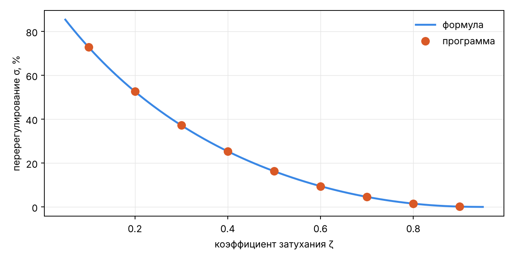
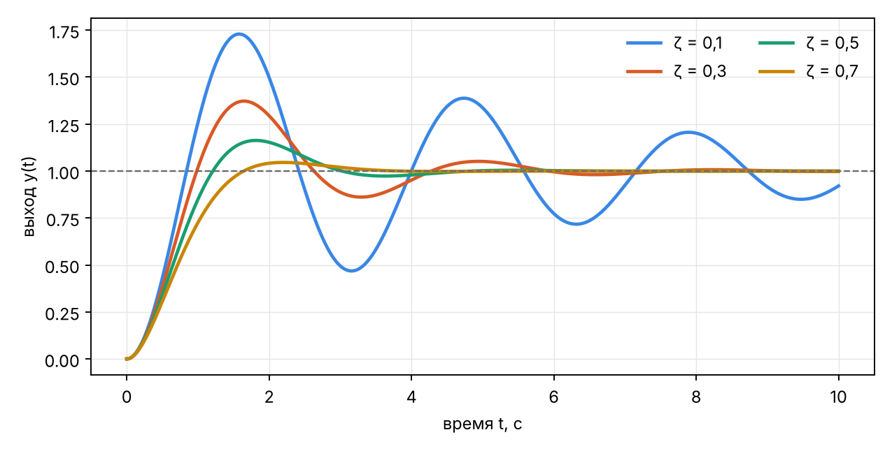
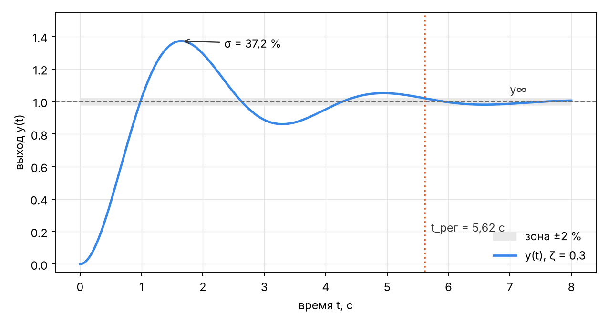

# Проверка модуля показателей качества

_Сгенерировано `backend/scripts/kp_quality_study.py` · Python 3.13.16 · Linux-6.18.44-fc-v80-x86_64-with-glibc2.39._
Расчёт идёт через `simulate_request` — тот же путь, что и запрос `/simulate`; шаг сетки 0,001 с.

## 1. Звено 1-го порядка K/(Ts + 1), K = 2

| T, с | y∞ (программа) | y∞ = K | t_н (программа), с | t_н = T·ln 9, с | t_рег (программа), с | t_рег = T·ln 50, с | σ, % |
|---|---|---|---|---|---|---|---|
| 0.5 | 2.0000 | 2.0000 | 1.099 | 1.099 | 1.957 | 1.956 | 0.00 |
| 1.0 | 2.0000 | 2.0000 | 2.197 | 2.197 | 3.913 | 3.912 | 0.00 |
| 2.0 | 2.0000 | 2.0000 | 4.394 | 4.394 | 7.825 | 7.824 | 0.00 |
| 5.0 | 2.0000 | 2.0000 | 10.986 | 10.986 | 19.561 | 19.560 | 0.00 |

## 2. Колебательное звено, ω₀ = 2 рад/с

| ζ | σ (программа), % | σ (формула), % | t_рег (программа), с | t_рег ≈ 4/(ζω₀), с | t_н (программа), с |
|---|---|---|---|---|---|
| 0.1 | 72.92 | 72.92 | 19.19 | 20.00 | 0.552 |
| 0.2 | 52.66 | 52.66 | 9.80 | 10.00 | 0.602 |
| 0.3 | 37.23 | 37.23 | 5.62 | 6.67 | 0.661 |
| 0.4 | 25.38 | 25.38 | 4.21 | 5.00 | 0.732 |
| 0.5 | 16.30 | 16.30 | 4.04 | 4.00 | 0.819 |
| 0.6 | 9.48 | 9.48 | 2.97 | 3.33 | 0.927 |
| 0.7 | 4.60 | 4.60 | 2.99 | 2.86 | 1.063 |
| 0.8 | 1.52 | 1.52 | 1.88 | 2.50 | 1.234 |
| 0.9 | 0.15 | 0.15 | 2.35 | 2.22 | 1.441 |

