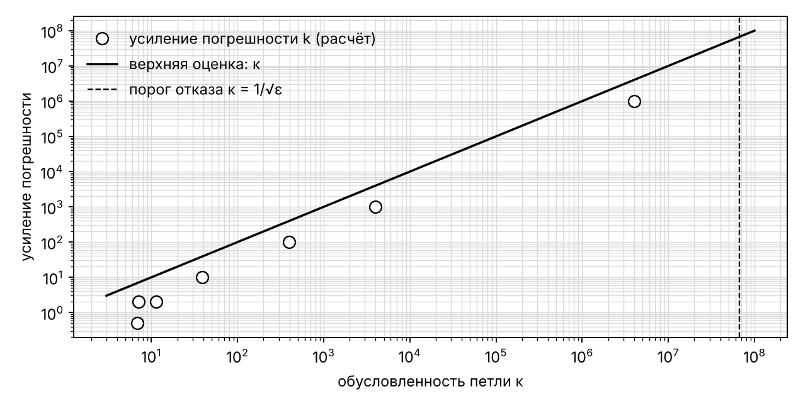
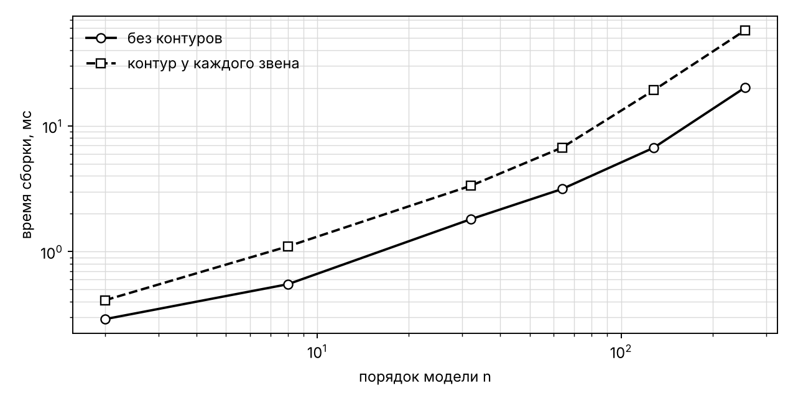

# Исследование метода построения модели по структурной схеме

_Сгенерировано `backend/scripts/nir_assembly_study.py` · Python 3.13.16 · Linux-6.18.44-fc-v114-x86_64-with-glibc2.39._

## 1. Корректность на эталонных схемах

| схема | порядок n | входы × выходы | алг. контуры | ошибка метода | поблочный подход |
|---|---|---|---|---|---|
| series | 2 | 1 × 1 | 0 | 1.8e-16 | 1.8e-16 |
| parallel | 2 | 1 × 1 | 0 | 1.6e-16 | 1.6e-16 |
| branching | 1 | 1 × 2 | 0 | 0.0e+00 | 0.0e+00 |
| negative_feedback | 2 | 1 × 1 | 0 | 4.7e-16 | 4.7e-16 |
| positive_feedback | 1 | 1 × 1 | 0 | 0.0e+00 | 0.0e+00 |
| pid_loop | 3 | 1 × 1 | 0 | 6.1e-16 | 6.1e-16 |
| biproper_loop | 1 | 1 × 1 | 1 | 1.1e-16 | не собирает |
| static_loop | 0 | 1 × 1 | 1 | 0.0e+00 | не собирает |
| subsystem_feedback | 1 | 1 × 1 | 0 | 1.1e-16 | 1.1e-16 |
| flat_subsystem_feedback | 1 | 1 × 1 | 0 | 1.1e-16 | 1.1e-16 |
| two_instances | 2 | 1 × 1 | 0 | 5.6e-17 | 5.6e-17 |
| two_instances_with_inner_scopes | 2 | 1 × 3 | 0 | 5.6e-17 | 5.6e-17 |
| pass_through | 1 | 1 × 1 | 0 | 0.0e+00 | 0.0e+00 |
| nested_feedback | 1 | 1 × 1 | 0 | 1.1e-16 | 1.1e-16 |
| mimo_subsystem | 1 | 2 × 2 | 0 | 0.0e+00 | 0.0e+00 |
| butterworth | 4 | 1 × 1 | 0 | 8.9e-16 | 8.9e-16 |

## 2. Алгебраические контуры: y = k·(u + y)

Порог отказа: κ > 6.71e+07.

| k | κ скалярной петли | κ (программа) | y программы | y точное | отн. ошибка | усиление погрешности k | итог |
|---|---|---|---|---|---|---|---|
| 0.5 | 3 | 7.12 | 1 | 1 | 0.0e+00 | 2 | решён |
| 0.9 | 19 | 39 | 9 | 9 | 0.0e+00 | 10 | решён |
| 0.99 | 199 | 399 | 99 | 99 | 0.0e+00 | 100 | решён |
| 0.999 | 2e+03 | 4e+03 | 999 | 999 | 0.0e+00 | 1e+03 | решён |
| 0.999999 | 2e+06 | 4e+06 | 999999 | 999999 | 0.0e+00 | 1e+06 | решён |
| 0.999999999999 | 2e+12 | — | — | 1e+12 | — | — | отказ: плохо обусловлен |
| 1 | inf | — | — | inf | — | — | отказ: вырожден |
| 1.5 | 5 | 11.4 | -3 | -3 | 1.5e-16 | 2 | решён |
| 3 | 2 | 6.83 | -1.5 | -1.5 | 1.5e-16 | 0.5 | решён |

## 3. Иерархия

| сравнение | макс. расхождение y(t) |
|---|---|
| контур через подсистему ↔ та же схема без подсистем | 0.0e+00 |

| глубина вложенности | блоков после раскрытия | порядок n | раскрытие, мс | сборка целиком, мс | отличие y(t) от глубины 1 |
|---|---|---|---|---|---|
| 1 | 4 | 1 | 0.08 | 0.43 | 0.0e+00 |
| 2 | 4 | 1 | 0.10 | 0.49 | 0.0e+00 |
| 4 | 4 | 1 | 0.26 | 0.57 | 0.0e+00 |
| 8 | 4 | 1 | 0.18 | 0.65 | 0.0e+00 |
| 16 | 4 | 1 | 0.26 | 1.00 | 0.0e+00 |
| 32 | 4 | 1 | 0.64 | 1.61 | 0.0e+00 |

## 4. Время сборки

| порядок n | блоков (без контуров) | сборка, мс (без контуров) | блоков (контур у каждого звена) | сборка, мс (контур у каждого звена) |
|---|---|---|---|---|
| 2 | 4 | 0.29 | 6 | 0.41 |
| 8 | 10 | 0.55 | 18 | 1.10 |
| 32 | 34 | 1.81 | 66 | 3.34 |
| 64 | 66 | 3.15 | 130 | 6.73 |
| 128 | 130 | 6.70 | 258 | 19.21 |
| 256 | 258 | 20.21 | 514 | 57.66 |

