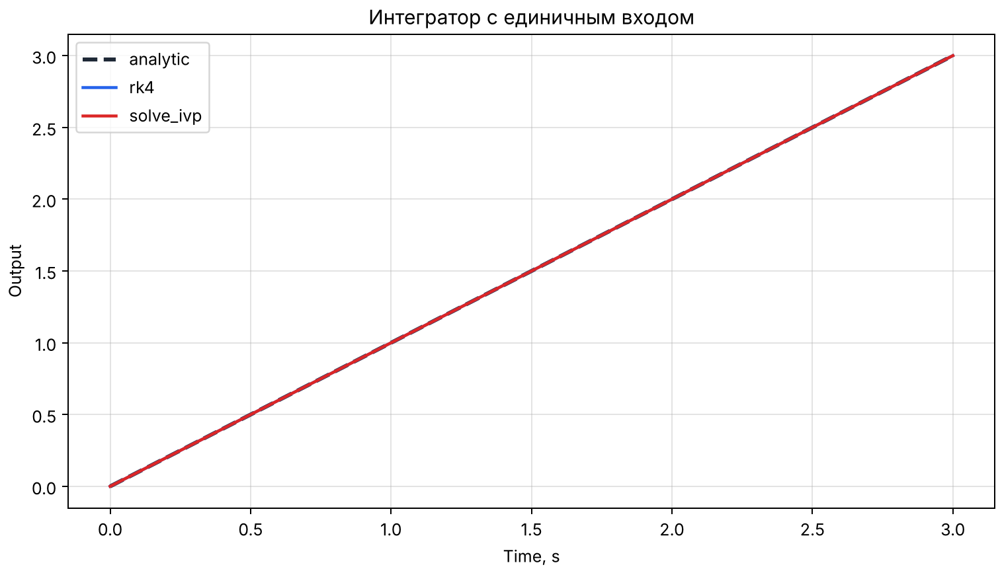
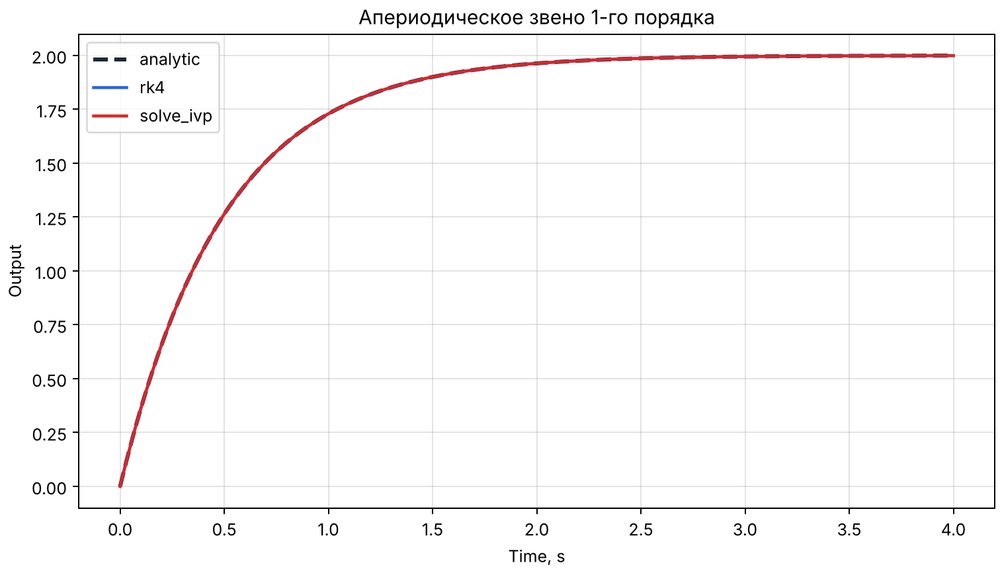
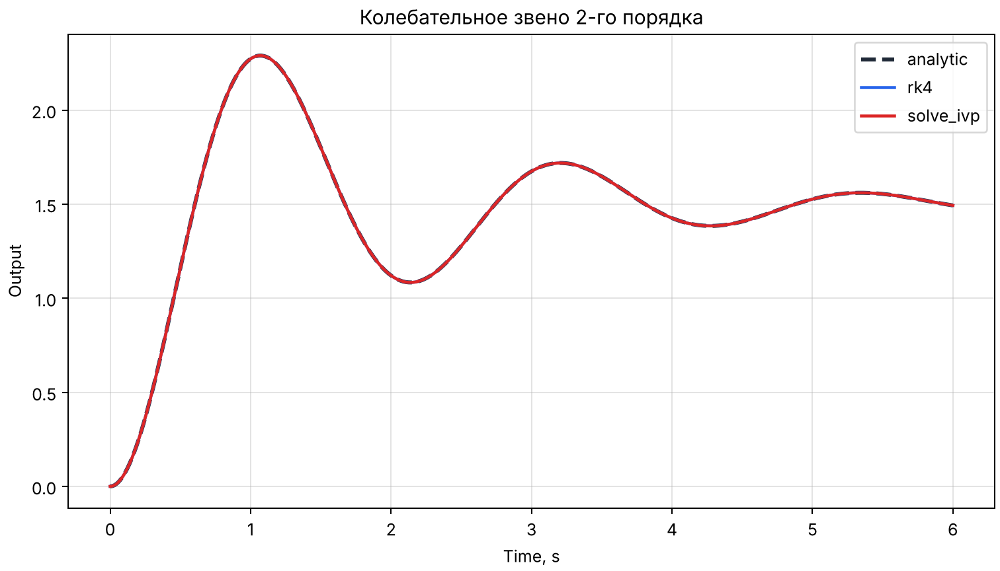
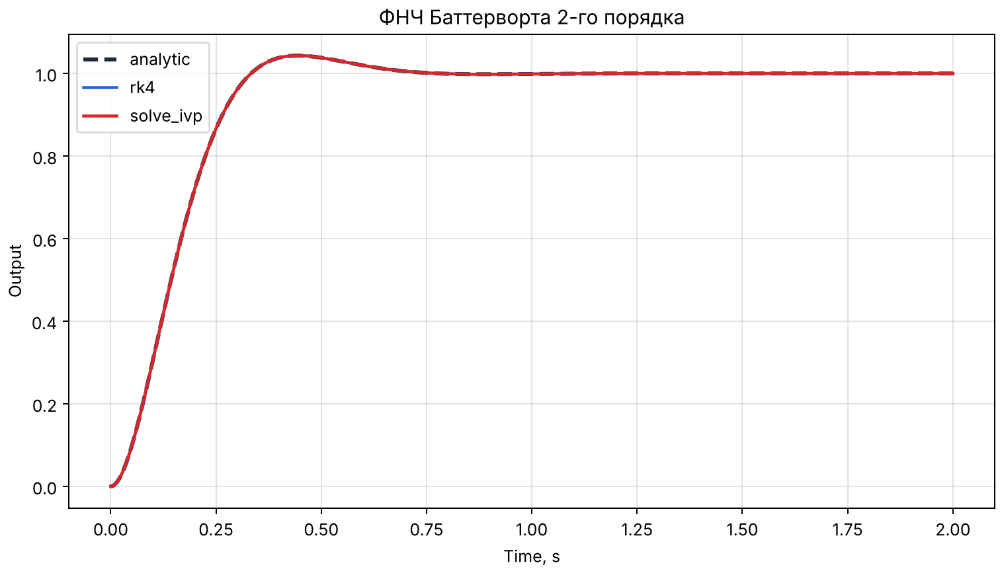
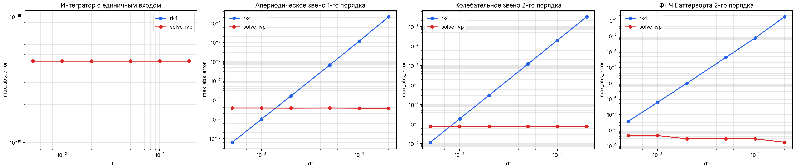
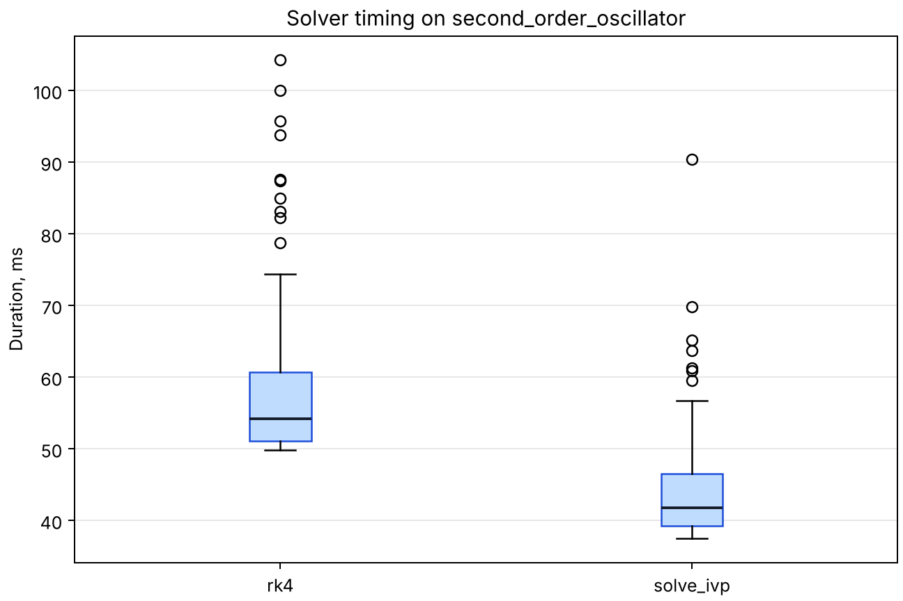
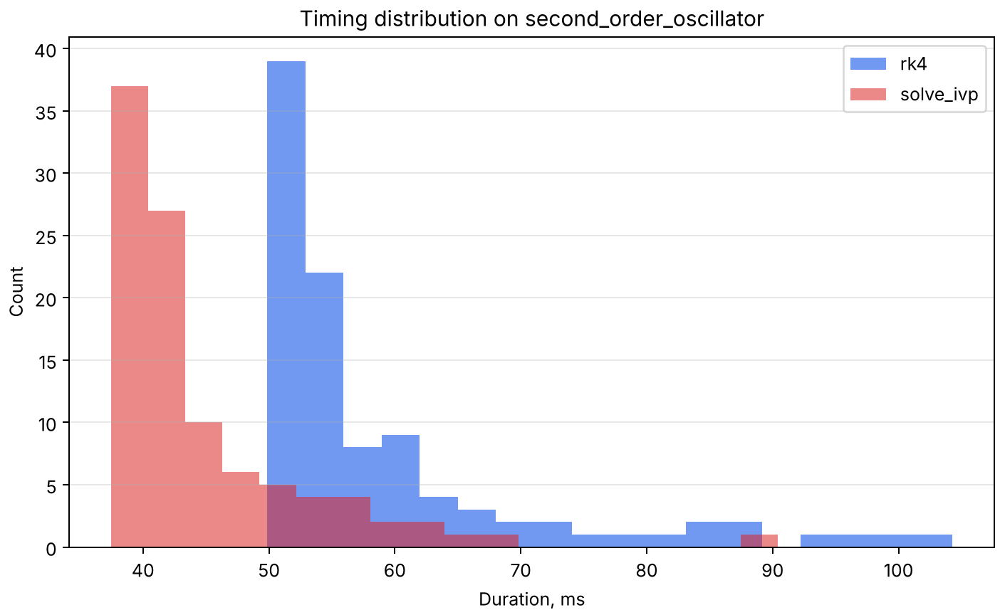

# Экспериментальная часть НИР

_Файл сгенерирован скриптом `scripts/benchmarks/run_experiments.py`._

## Цель экспериментальной части
Цель экспериментов состоит в том, чтобы воспроизводимо оценить точность и вычислительные затраты текущего backend-ядра на ограниченном наборе эталонных структурных схем. Материалы ниже подготовлены из автоматически сгенерированных CSV/JSON и фигур, без ручной подстановки чисел.

## Тестовые схемы
| Схема | Источник | t_end | Базовый dt | Описание |
| --- | --- | --- | --- | --- |
| Интегратор с единичным входом | examples/integrator_step.json | 3.0000 | 1.000e-02 | Идеальный интегратор под действием единичного ступенчатого сигнала. |
| Апериодическое звено 1-го порядка | examples/first_order_lag_step.json | 4.0000 | 1.000e-02 | FirstOrderLag с k=2.0, T=0.5 на единичный скачок. |
| Колебательное звено 2-го порядка | examples/second_order_oscillator_step.json | 6.0000 | 5.000e-03 | SecondOrderOscillator с k=1.5, wn=3.0, zeta=0.2 на единичный скачок. |
| ФНЧ Баттерворта 2-го порядка | examples/butterworth_lpf_step.json | 2.0000 | 1.000e-03 | ButterworthLPF с order=2, cutoff_freq=10 рад/с на единичный скачок. |

Краткий вывод. Для экспериментов использованы четыре схемы с аналитическими эталонами, покрывающие интегрирующий, апериодический, колебательный режимы и ФНЧ Баттерворта.

## Условия моделирования
- Дата генерации артефактов: `2026-10-09T08:08:02+00:00`.
- Python: `3.13.16`.
- Платформа: `Linux-6.18.44-fc-v80-x86_64-with-glibc2.39`.
- Solver-ы: `rk4, solve_ivp`.
- Sweep по dt: `0.2, 0.1, 0.05, 0.02, 0.01, 0.005`.
- Бенчмарк: `second_order_oscillator`, repetitions=`100`, warmup=`10`.

## Таблица ошибок для эталонных схем
| Схема | Solver | dt | max_abs_error | RMSE | final_value_error |
| --- | --- | --- | --- | --- | --- |
| Интегратор с единичным входом | rk4 | 1.000e-02 | 0.000e+00 | 0.000e+00 | 0.000e+00 |
| Интегратор с единичным входом | solve_ivp | 1.000e-02 | 4.441e-16 | 1.573e-16 | 0.000e+00 |
| Апериодическое звено 1-го порядка | rk4 | 1.000e-02 | 9.975e-10 | 4.787e-10 | -7.277e-12 |
| Апериодическое звено 1-го порядка | solve_ivp | 1.000e-02 | 3.825e-09 | 1.890e-09 | -3.033e-09 |
| Колебательное звено 2-го порядка | rk4 | 5.000e-03 | 1.165e-09 | 5.942e-10 | 1.299e-10 |
| Колебательное звено 2-го порядка | solve_ivp | 5.000e-03 | 7.680e-09 | 3.872e-09 | 2.835e-09 |
| ФНЧ Баттерворта 2-го порядка | rk4 | 1.000e-03 | 5.719e-11 | 1.760e-11 | -2.287e-14 |
| ФНЧ Баттерворта 2-го порядка | solve_ivp | 1.000e-03 | 4.529e-09 | 1.030e-09 | 2.678e-11 |

Краткий вывод. На базовых прогонах наблюдаемый диапазон `max_abs_error` составил от `0.000e+00` до `7.680e-09`. Наилучший результат в этой выборке дал `rk4` для схемы `integrator` (`0.000e+00`), наибольшая ошибка наблюдалась для `solve_ivp` на схеме `second_order_oscillator` (`7.680e-09`).

## Графики переходных процессов
### Интегратор с единичным входом

Краткий вывод. На графике совмещены аналитическая кривая и оба solver-а; визуальное совпадение следует трактовать вместе с таблицей ошибок, а не как самостоятельное доказательство точности.

### Апериодическое звено 1-го порядка

Краткий вывод. На графике совмещены аналитическая кривая и оба solver-а; визуальное совпадение следует трактовать вместе с таблицей ошибок, а не как самостоятельное доказательство точности.

### Колебательное звено 2-го порядка

Краткий вывод. На графике совмещены аналитическая кривая и оба solver-а; визуальное совпадение следует трактовать вместе с таблицей ошибок, а не как самостоятельное доказательство точности.

### ФНЧ Баттерворта 2-го порядка

Краткий вывод. На графике совмещены аналитическая кривая и оба solver-а; визуальное совпадение следует трактовать вместе с таблицей ошибок, а не как самостоятельное доказательство точности.

## Сравнение rk4 и solve_ivp
| Схема | max_abs_diff | RMSE_diff | final_value_diff |
| --- | --- | --- | --- |
| Интегратор с единичным входом | 4.441e-16 | 1.573e-16 | 0.000e+00 |
| Апериодическое звено 1-го порядка | 3.803e-09 | 1.913e-09 | 3.026e-09 |
| Колебательное звено 2-го порядка | 7.702e-09 | 3.976e-09 | -2.705e-09 |
| ФНЧ Баттерворта 2-го порядка | 4.578e-09 | 1.028e-09 | -2.680e-11 |

Краткий вывод. Различия между `rk4` и `solve_ivp` на одинаковой сетке времени остаются измеримыми, но на рассмотренных схемах не меняют качественную форму переходных процессов.

## График ошибки от dt

| Схема | Solver | Крупный dt | Ошибка при крупном dt | Малый dt | Ошибка при малом dt | Во сколько раз уменьшилась ошибка |
| --- | --- | --- | --- | --- | --- | --- |
| Интегратор с единичным входом | rk4 | 2.000e-01 | 0.000e+00 | 5.000e-03 | 0.000e+00 | exact |
| Интегратор с единичным входом | solve_ivp | 2.000e-01 | 4.441e-16 | 5.000e-03 | 4.441e-16 | 1.0000 |
| Апериодическое звено 1-го порядка | rk4 | 2.000e-01 | 2.156e-04 | 5.000e-03 | 6.183e-11 | 3486893.9299 |
| Апериодическое звено 1-го порядка | solve_ivp | 2.000e-01 | 3.762e-09 | 5.000e-03 | 3.826e-09 | 0.9834 |
| Колебательное звено 2-го порядка | rk4 | 2.000e-01 | 3.200e-03 | 5.000e-03 | 1.165e-09 | 2746023.3401 |
| Колебательное звено 2-го порядка | solve_ivp | 2.000e-01 | 7.570e-09 | 5.000e-03 | 7.680e-09 | 0.9857 |
| ФНЧ Баттерворта 2-го порядка | rk4 | 2.000e-01 | 1.690e-01 | 5.000e-03 | 3.638e-08 | 4645114.4443 |
| ФНЧ Баттерворта 2-го порядка | solve_ivp | 2.000e-01 | 1.664e-09 | 5.000e-03 | 4.529e-09 | 0.3673 |

Краткий вывод. На исследованной сетке уменьшение `dt` для `rk4` приводит к ожидаемому снижению ошибки. Для `solve_ivp` этот график нужно трактовать осторожно, потому что в текущем API параметр `dt` задаёт прежде всего сетку сохранения результата, а внутренний шаг интегрирования у `solve_ivp` остаётся адаптивным.

## Бенчмарки времени
| Solver | mean_ms | median_ms | std_ms | min_ms | max_ms | N |
| --- | --- | --- | --- | --- | --- | --- |
| rk4 | 58.8887 | 54.1897 | 11.9747 | 49.8782 | 104.2923 | 100 |
| solve_ivp | 44.6490 | 41.7402 | 8.2738 | 37.4806 | 90.3848 | 100 |

Краткий вывод. В данном запуске более низкую медиану времени показал `solve_ivp` (`41.7402` ms), а более высокую — `rk4` (`54.1897` ms). Эти абсолютные времена относятся только к текущей машине, версии Python и текущей сборке зависимостей.

## Ограничения интерпретации результатов
- Эксперименты охватывают только четыре эталонные схемы из ограниченной библиотеки блоков и не доказывают универсальность для произвольных динамических систем.
- Для `solve_ivp` зависимость ошибки от `dt` нельзя трактовать так же, как для `rk4`, поскольку внутренний шаг интегрирования выбирается адаптивно, а `dt` влияет главным образом на сетку вывода.
- Бенчмарк включает не только собственно solver, но и компиляцию диаграммы, построение временной сетки и вычисление выходов Scope, то есть отражает время полного backend-пайплайна, а не изолированного численного ядра.
- Абсолютные времена исполнения зависят от локальной машины и окружения; переносить их в отчёт без повторного прогона на целевой машине не следует.
- Наличие аналитического эталона в этих сценариях упрощает интерпретацию; для более сложных схем в дальнейшем потребуется отдельная методика верификации.
