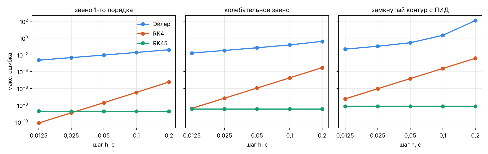
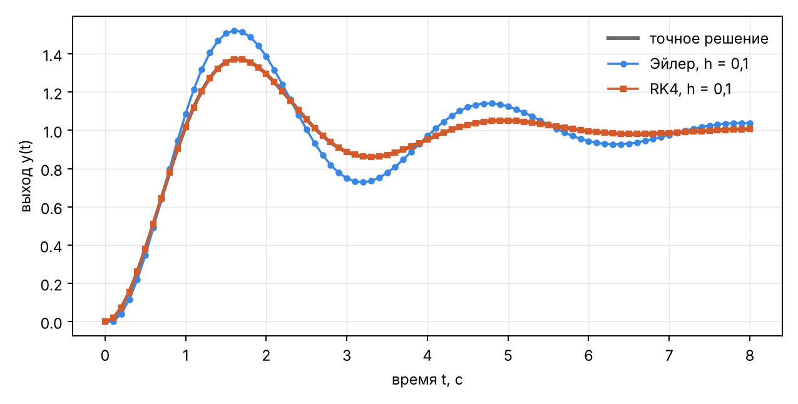
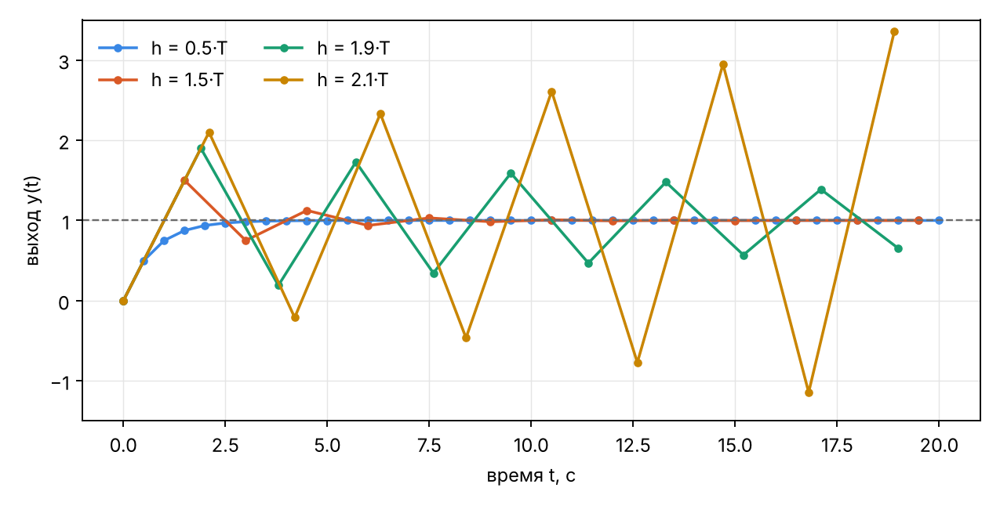

# Численные методы вычислительного ядра: Эйлер, RK4, RK45

_Сгенерировано `backend/scripts/nir_solver_study.py` · Python 3.13.16 · Linux-6.18.44-fc-v80-x86_64-with-glibc2.39._
Эталон — точное решение через матричную экспоненту. Таблицы — `docs/study/nir_*.csv`.

## 1. Точность от шага

| схема | шаг h | ошибка Эйлер | ошибка RK4 | ошибка RK45 | порядок Эйлер | порядок RK4 |
|---|---|---|---|---|---|---|
| звено 1-го порядка | 0.2 | 4.02e-02 | 5.80e-06 | 1.84e-09 | — | — |
| звено 1-го порядка | 0.1 | 1.92e-02 | 3.33e-07 | 1.90e-09 | 1.07 | 4.12 |
| звено 1-го порядка | 0.05 | 9.39e-03 | 2.00e-08 | 1.91e-09 | 1.03 | 4.06 |
| звено 1-го порядка | 0.025 | 4.65e-03 | 1.22e-09 | 1.91e-09 | 1.02 | 4.03 |
| звено 1-го порядка | 0.0125 | 2.31e-03 | 7.56e-11 | 1.92e-09 | 1.01 | 4.02 |
| колебательное звено | 0.2 | 4.01e-01 | 2.98e-04 | 3.61e-09 | — | — |
| колебательное звено | 0.1 | 1.52e-01 | 1.78e-05 | 3.61e-09 | 1.40 | 4.06 |
| колебательное звено | 0.05 | 6.95e-02 | 1.09e-06 | 3.61e-09 | 1.13 | 4.03 |
| колебательное звено | 0.025 | 3.33e-02 | 6.74e-08 | 3.61e-09 | 1.06 | 4.02 |
| колебательное звено | 0.0125 | 1.63e-02 | 4.19e-09 | 3.61e-09 | 1.03 | 4.01 |
| замкнутый контур с ПИД | 0.2 | 1.20e+02 | 3.89e-03 | 7.35e-09 | — | — |
| замкнутый контур с ПИД | 0.1 | 2.11e+00 | 2.37e-04 | 7.35e-09 | 5.83 | 4.04 |
| замкнутый контур с ПИД | 0.05 | 2.75e-01 | 1.46e-05 | 7.35e-09 | 2.94 | 4.02 |
| замкнутый контур с ПИД | 0.025 | 1.06e-01 | 9.08e-07 | 7.37e-09 | 1.38 | 4.01 |
| замкнутый контур с ПИД | 0.0125 | 4.74e-02 | 5.65e-08 | 7.43e-09 | 1.15 | 4.01 |

## 2. Шаг для ошибки не больше 10⁻³ на интервале 8 с

| схема | шаг Эйлер | шагов Эйлер | шаг RK4 | шагов RK4 | выигрыш RK4, раз |
|---|---|---|---|---|---|
| звено 1-го порядка | 0.00390625 | 2048 | 0.5 | 16 | 128 |
| колебательное звено | 0.000488281 | 16384 | 0.25 | 32 | 512 |
| замкнутый контур с ПИД | 0.000244141 | 32768 | 0.125 | 64 | 512 |

## 3. Устойчивость метода Эйлера на звене 1-го порядка (T = 1)

Один шаг Эйлера умножает отклонение от установившегося значения на (1 − h/T), поэтому при h > 2T расчёт
расходится, хотя само звено устойчиво.

| h / T | множитель ошибки за шаг | Эйлер: откл. при t = 30 | Эйлер: итог | RK4: откл. при t = 30 | RK4: итог |
|---|---|---|---|---|---|
| 0.5 | 0.5 | 0.0e+00 | сходится | 9.6e-14 | сходится |
| 1.0 | 0.0 | 0.0e+00 | сходится | 1.7e-13 | сходится |
| 1.5 | 0.5 | 9.5e-07 | сходится | 5.5e-12 | сходится |
| 1.9 | 0.9 | 1.9e-01 | сходится | 5.6e-09 | сходится |
| 2.1 | 1.1 | 3.8e+00 | расходится | 9.7e-07 | сходится |
| 2.5 | 1.5 | 1.3e+02 | расходится | 5.5e-03 | сходится |

## 4. Время расчёта (контур с ПИД, 10 с, h = 0,01)

| метод | вычислений f на шаг | время, мс (медиана) | ошибка при h = 0,01 |
|---|---|---|---|
| Эйлер | 1 | 7.45 | 3.7e-02 |
| RK4 | 4 | 23.41 | 2.3e-08 |
| RK45 | переменно | 19.28 | 7.4e-09 |
