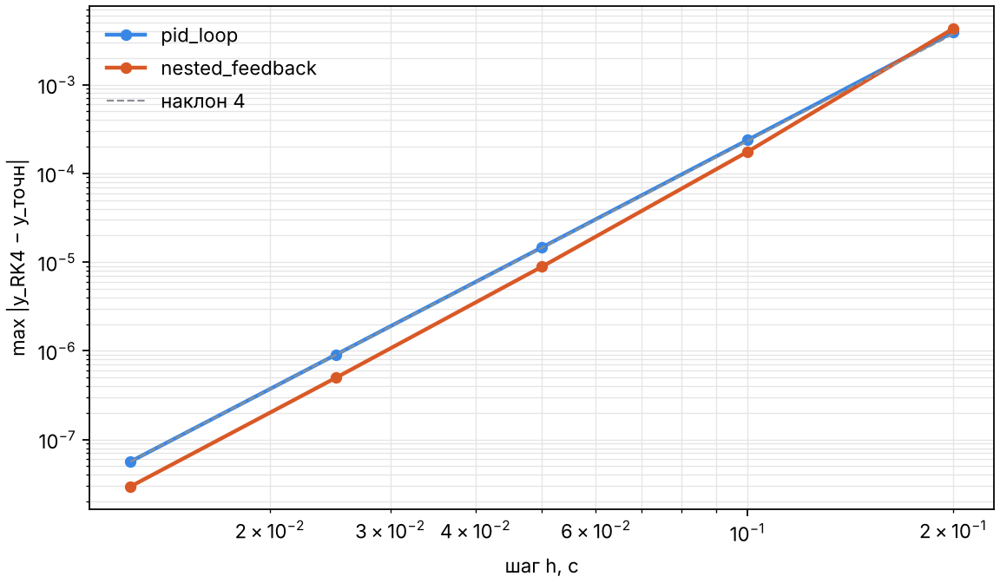

# Численное исследование ядра Control Lab

_Сгенерировано `backend/scripts/numerical_study.py` · Python 3.13.16 · Linux-6.18.44-fc-v80-x86_64-with-glibc2.39._
Таблицы лежат в `docs/study/*.csv`; числа ниже не редактируются вручную.

## 1. Корректность компиляции структурных схем

Для каждой эталонной схемы из `app/tests/structural_cases.py` собранная модель (A, B, C, D) сравнивается с
передаточной матрицей, полученной правилами структурных преобразований, в четырёх точках s:
`max |C(sI − A)⁻¹B + D − G(s)| / max(1, |G(s)|)`.

| схема | n | входы | выходы | алг. петли | макс. отн. ошибка G(s) |
|---|---|---|---|---|---|
| series | 2 | 1 | 1 | 0 | 1.8e-16 |
| parallel | 2 | 1 | 1 | 0 | 1.6e-16 |
| branching | 1 | 1 | 2 | 0 | 0.0e+00 |
| negative_feedback | 2 | 1 | 1 | 0 | 4.7e-16 |
| positive_feedback | 1 | 1 | 1 | 0 | 0.0e+00 |
| pid_loop | 3 | 1 | 1 | 0 | 6.1e-16 |
| biproper_loop | 1 | 1 | 1 | 1 | 1.1e-16 |
| static_loop | 0 | 1 | 1 | 1 | 0.0e+00 |
| subsystem_feedback | 1 | 1 | 1 | 0 | 1.1e-16 |
| flat_subsystem_feedback | 1 | 1 | 1 | 0 | 1.1e-16 |
| two_instances | 2 | 1 | 1 | 0 | 5.6e-17 |
| two_instances_with_inner_scopes | 2 | 1 | 3 | 0 | 5.6e-17 |
| pass_through | 1 | 1 | 1 | 0 | 0.0e+00 |
| nested_feedback | 1 | 1 | 1 | 0 | 1.1e-16 |
| mimo_subsystem | 1 | 2 | 2 | 0 | 0.0e+00 |
| butterworth | 4 | 1 | 1 | 0 | 8.9e-16 |

Вложенные схемы дают те же передаточные функции, что и их плоские эквиваленты. Алгебраические петли
(бипропер-звено и статическая петля) решаются точно.

## 2. Точность интегрирования относительно точного решения

Эталон — решение `x(t+h) = e^(Ah) x(t) + ∫e^(As)ds · B r`, точное для ступенчатых входов.
Порядок RK4 = log₂(e(h)/e(h/2)); теоретическое значение 4.

| схема | dt | ошибка RK4 | порядок RK4 | ошибка RK45 |
|---|---|---|---|---|
| pid_loop | 0.2 | 3.89e-03 | — | 7.35e-09 |
| pid_loop | 0.1 | 2.37e-04 | 4.04 | 7.35e-09 |
| pid_loop | 0.05 | 1.46e-05 | 4.02 | 7.35e-09 |
| pid_loop | 0.025 | 9.08e-07 | 4.01 | 7.37e-09 |
| pid_loop | 0.0125 | 5.65e-08 | 4.01 | 7.43e-09 |
| nested_feedback | 0.2 | 4.27e-03 | — | 4.06e-09 |
| nested_feedback | 0.1 | 1.75e-04 | 4.61 | 4.07e-09 |
| nested_feedback | 0.05 | 8.85e-06 | 4.30 | 4.65e-09 |
| nested_feedback | 0.025 | 4.98e-07 | 4.15 | 4.65e-09 |
| nested_feedback | 0.0125 | 2.96e-08 | 4.08 | 4.65e-09 |

## 3. Граница устойчивости RK4 на мнимой оси

Для незатухающего осциллятора ω максимальный устойчивый шаг находится бисекцией по |R(hλ)| ≤ 1.
Теория: h·ω ≤ 2√2.

| ω, рад/с | h_max (численно) | h_max·ω | 2√2 |
|---|---|---|---|
| 1.0 | 2.828427 | 2.828427 | 2.828427 |
| 10.0 | 0.282843 | 2.828427 | 2.828427 |
| 100.0 | 0.028284 | 2.828427 | 2.828427 |

## 4. Управляемость: ранг Калмана и тест PBH

| порядок n | ранг Калмана | ранг PBH | запас PBH | cond(матрица Калмана) |
|---|---|---|---|---|
| 2 | 2 | 2 | 1.5e-02 | 2.0e+02 |
| 3 | 3 | 3 | 2.5e-03 | 4.1e+04 |
| 4 | 4 | 4 | 7.5e-04 | 7.1e+06 |
| 5 | 5 | 5 | 1.7e-04 | 1.1e+09 |
| 6 | 6 | 6 | 6.0e-05 | 1.6e+11 |
| 7 | 7 | 7 | 8.3e-06 | 2.2e+13 |
| 8 | 7 | 8 | 2.3e-06 | 3.0e+15 |
| 9 | 7 | 9 | 7.7e-07 | 3.9e+17 |
| 10 | 7 | 10 | 2.1e-07 | 5.0e+19 |

Матрица Калмана быстро теряет обусловленность. При n ≥ 8 численный ранг занижается, хотя
фильтр Баттерворта управляем при любом порядке. Тест PBH на сбалансированной реализации даёт правильный ранг.

## 5. Вычислительные затраты

Цепочка из n апериодических звеньев, 1000 шагов на интервале 10 с. Однократный замер wall-clock:
цифры показывают порядок величины; время RK45 зависит от числа шагов, выбранных адаптивно.

| n | сборка, мс | RK4 (1000 шагов), мс | RK45, мс |
|---|---|---|---|
| 2 | 1.30 | 98.2 | 32.7 |
| 8 | 2.11 | 88.1 | 22.6 |
| 32 | 2.91 | 42.4 | 30.9 |
| 64 | 4.41 | 50.0 | 31.2 |
| 128 | 13.24 | 87.7 | 42.0 |
